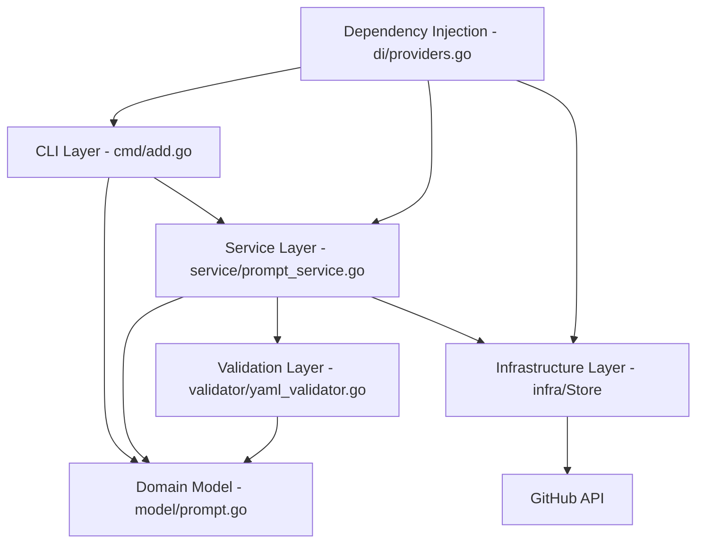
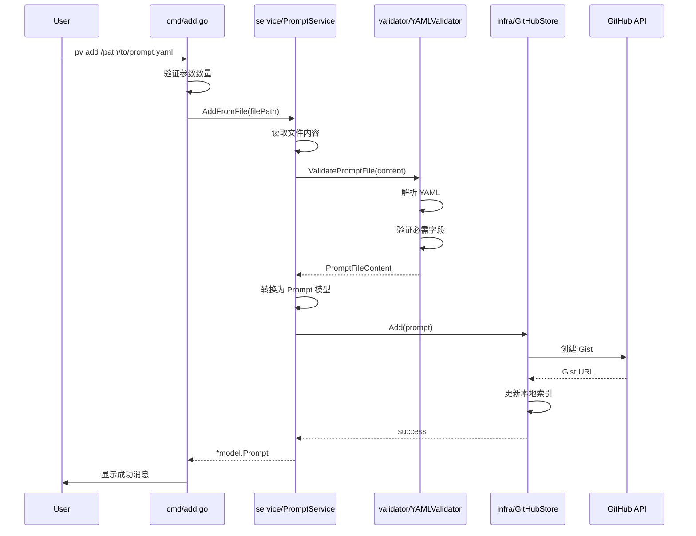

# Design - Add Command Feature

## Architecture Overview

add 命令功能将遵循现有的 clean architecture 模式，集成到现有的 Cobra CLI 框架和 Google Wire 依赖注入系统中。

### 系统架构图



## Component Design

### 1. Command Layer (`cmd/add.go`)

基于现有的命令模式，创建新的 add 命令：

```go
type AddCmd = *cobra.Command

type add struct {
    promptService service.PromptService
}

func (a *add) execute(cmd *cobra.Command, args []string) {
    // 验证参数
    // 调用 promptService.AddFromFile()
    // 处理结果和错误显示
}

func NewAddCommand(promptService service.PromptService) AddCmd {
    ac := &add{promptService: promptService}
    return &cobra.Command{
        Use:   "add <file_path>",
        Short: "Add a prompt file to the vault",
        Args:  cobra.ExactArgs(1),
        Run:   ac.execute,
    }
}
```

### 2. Service Layer (`internal/service/prompt_service.go`)

新增 PromptService 接口和实现，负责业务逻辑：

```go
type PromptService interface {
    AddFromFile(filePath string) (*model.Prompt, error)
}

type promptServiceImpl struct {
    store     infra.Store
    validator validator.YAMLValidator
}

func (p *promptServiceImpl) AddFromFile(filePath string) (*model.Prompt, error) {
    // 1. 读取文件
    // 2. 验证 YAML 格式和内容
    // 3. 解析为 Prompt 模型
    // 4. 调用 store.Add()
    // 5. 返回结果
}
```

### 3. Validation Layer (`internal/validator/yaml_validator.go`)

专门处理 YAML 文件验证的组件：

```go
type YAMLValidator interface {
    ValidatePromptFile(content []byte) (*PromptFileContent, error)
    ValidateRequired(prompt *PromptFileContent) error
}

type PromptFileContent struct {
    Metadata PromptMetadata `yaml:"---"`
    Content  string
}

type PromptMetadata struct {
    Name        string   `yaml:"name"`
    Author      string   `yaml:"author"`
    Description string   `yaml:"description,omitempty"`
    Tags        []string `yaml:"tags,omitempty"`
    Version     string   `yaml:"version,omitempty"`
}
```

### 4. Enhanced Store Interface

现有的 Store 接口已经有 Add 方法，但需要增强 GitHubStore 实现以处理文件内容：

```go
// 现有接口保持不变
type Store interface {
    List() ([]model.Prompt, error)
    Add(model.Prompt) error  // 增强实现以支持文件内容
    Delete(keyword string) error
    Update(model.Prompt) error
    Get(keyword string) ([]model.Prompt, error)
}
```

### 5. Enhanced Model (`internal/model/prompt.go`)

扩展 Prompt 模型以支持更多元数据：

```go
type Prompt struct {
    ID          string
    Name        string
    Author      string
    GistURL     string
    Description string   // 新增
    Tags        []string // 新增
    Version     string   // 新增
    Content     string   // 新增：存储实际的 prompt 内容
}
```

## Data Flow Design

### 添加 Prompt 的完整流程



## File Organization

### 新增文件结构
```
cmd/
├── add.go                    # 新增：Add 命令实现
├── list.go                   # 现有
└── root.go                   # 修改：添加 AddCmd

internal/
├── service/
│   ├── prompt_service.go     # 新增：Prompt 业务逻辑
│   └── prompt_service_impl.go # 新增：实现
├── validator/
│   ├── yaml_validator.go     # 新增：YAML 验证接口
│   └── yaml_validator_impl.go # 新增：验证实现
├── model/
│   └── prompt.go             # 修改：扩展 Prompt 结构
└── di/
    └── providers.go          # 修改：添加新的 providers
```

## Interface Contracts

### 1. PromptService Interface
```go
type PromptService interface {
    AddFromFile(filePath string) (*model.Prompt, error)
    // 未来可能扩展的方法
    // ValidateFile(filePath string) error
    // ImportBatch(dirPath string) ([]model.Prompt, error)
}
```

### 2. YAMLValidator Interface
```go
type YAMLValidator interface {
    ValidatePromptFile(content []byte) (*PromptFileContent, error)
    ValidateRequired(metadata *PromptMetadata) error
}
```

### 3. Error Types (`internal/errors/prompt_errors.go`)
```go
var (
    ErrFileNotFound     = errors.New("prompt file not found")
    ErrInvalidYAML      = errors.New("invalid YAML format")
    ErrMissingRequired  = errors.New("missing required fields")
    ErrInvalidMetadata  = errors.New("invalid metadata")
)

type ValidationError struct {
    Field   string
    Message string
}

func (e ValidationError) Error() string {
    return fmt.Sprintf("validation error in field '%s': %s", e.Field, e.Message)
}
```

## Integration Points

### 1. Dependency Injection Updates

在 `internal/di/providers.go` 中添加新的 providers：

```go
func ProvidePromptService(store infra.Store, validator validator.YAMLValidator) service.PromptService {
    return service.NewPromptService(store, validator)
}

func ProvideYAMLValidator() validator.YAMLValidator {
    return validator.NewYAMLValidator()
}

func ProvideCommands(store infra.Store, authService service.AuthService, promptService service.PromptService) Commands {
    listCmd := cmd.NewListCommand(store)
    authCmd := ProvideAuthCommands(authService)
    addCmd := cmd.NewAddCommand(promptService)  // 新增
    return Commands{
        ListCmd: listCmd,
        AuthCmd: authCmd,
        AddCmd:  addCmd,  // 新增
    }
}
```

### 2. Root Command Integration

在 `cmd/root.go` 中集成新命令：

```go
func NewRootCommand(lc ListCmd, authCmd AuthCmd, addCmd AddCmd) RootCmd {
    root := &cobra.Command{
        Use:   "pv",
        Short: "Prompt Vault CLI",
        Run: func(cmd *cobra.Command, args []string) {
            fmt.Println("Hello, pv!")
        },
    }
    root.AddCommand(lc, authCmd, addCmd)  // 添加 addCmd
    return root
}
```

## Configuration and Settings

### YAML 文件格式规范

支持的 YAML 格式：
```yaml
name: "示例 Prompt"
author: "作者名称"  
description: "可选的描述信息"
tags:
  - "AI"
  - "编程"
version: "1.0"
---
这里是 prompt 的实际内容。

可以包含多行文本，支持 Markdown 格式。

## 示例用法
请按照以下格式...
```

### 验证规则
- `name`: 必需，1-100 字符，不能为空
- `author`: 必需，1-50 字符  
- `description`: 可选，最大 500 字符
- `tags`: 可选，数组，每个标签最大 20 字符
- `version`: 可选，语义版本格式 (如 "1.0.0")
- 内容部分：使用 `---` 分隔符后的所有内容

## Error Handling Strategy

### 1. 用户友好的错误消息
```go
func (a *add) execute(cmd *cobra.Command, args []string) {
    prompt, err := a.promptService.AddFromFile(args[0])
    if err != nil {
        switch {
        case errors.Is(err, errors.ErrFileNotFound):
            fmt.Printf("错误：找不到文件 '%s'\n", args[0])
        case errors.Is(err, errors.ErrInvalidYAML):
            fmt.Printf("错误：YAML 格式无效\n%v\n", err)
        case errors.Is(err, errors.ErrMissingRequired):
            fmt.Printf("错误：缺少必需的字段\n%v\n", err)
        default:
            fmt.Printf("添加 prompt 时发生错误：%v\n", err)
        }
        return
    }
    
    fmt.Printf("✅ 成功添加 prompt '%s'\n", prompt.Name)
    fmt.Printf("🔗 Gist URL: %s\n", prompt.GistURL)
}
```

### 2. 事务性操作
确保操作的原子性：
- 如果 GitHub Gist 创建失败，不更新本地索引
- 提供回滚机制处理部分失败的情况

## Performance Considerations

### 1. 文件大小限制
- 最大文件大小：1MB
- 对大文件进行警告提示

### 2. 网络优化
- 实现重试机制处理网络临时故障
- 添加超时配置

### 3. 缓存策略
- 验证结果缓存（避免重复验证相同文件）
- GitHub API 响应缓存

## Testing Strategy

### 1. 单元测试覆盖
- YAMLValidator 的各种输入场景
- PromptService 的业务逻辑
- 错误处理路径

### 2. 集成测试
- 端到端命令执行
- GitHub API 集成（使用 mock）

### 3. 测试文件示例
```
testdata/
├── valid_prompt.yaml      # 有效的 prompt 文件
├── invalid_yaml.yaml      # 无效的 YAML 格式
├── missing_required.yaml  # 缺少必需字段
└── large_file.yaml        # 大文件测试
```

## Security Considerations

### 1. 文件安全
- 验证文件路径，防止路径遍历攻击
- 限制文件大小，防止内存耗尽

### 2. 内容安全
- 扫描敏感信息（API keys, 密码等）
- 提供选项创建私有 Gist

### 3. GitHub API 安全
- 使用现有的认证机制
- 实现 API 限制处理

## Migration and Compatibility

### 1. 现有数据兼容性
- 新的 Prompt 模型字段设为可选
- 现有 list 命令保持兼容

### 2. 向后兼容
- 现有的 Store 接口方法签名不变
- 添加新功能时不破坏现有功能

## Future Enhancements

### 1. 批量导入
- `pv add --dir /path/to/prompts/` 支持目录导入
- 进度条显示批量操作进度

### 2. 模板支持
- `pv add --template basic` 使用模板创建新 prompt
- 可配置的模板系统

### 3. 验证规则扩展
- 自定义验证规则配置
- 社区验证规则分享