# Design: Prompt Vault Delete 功能技术设计

## 架构概览

本设计基于现有的 Prompt Vault 架构，集成 bubbletea 框架提供交互式删除功能。设计遵循清洁架构原则，保持与现有系统的兼容性和一致性。

```mermaid
graph TB
    User[用户] --> CLI[CLI Layer]
    CLI --> DeleteCmd[Delete Command]
    DeleteCmd --> TUI[Bubbletea TUI]
    DeleteCmd --> PromptService[Prompt Service]
    PromptService --> Store[Store Interface]
    Store --> GitHubStore[GitHub Store]
    GitHubStore --> GitHub[GitHub Gists API]
    
    subgraph "新增组件"
        DeleteCmd
        TUI
        DeleteTUI[Delete TUI Model]
        ConfirmTUI[Confirm TUI Model]
    end
    
    subgraph "现有架构"
        PromptService
        Store
        GitHubStore
        GitHub
    end
```



## 核心组件设计

### 1. Delete Command (`cmd/delete.go`)

基于现有的 `cmd/add.go` 和 `cmd/list.go` 模式设计：

```go
type delete struct {
    store        infra.Store
    promptService service.PromptService
}

type DeleteCmd = *cobra.Command

// 命令构造函数
func NewDeleteCommand(store infra.Store, promptService service.PromptService) DeleteCmd
```

**核心职责**:
- 解析命令行参数（无参数、关键字、URL）
- 路由到相应的删除模式处理函数
- 集成 bubbletea TUI 界面
- 错误处理和用户反馈

**三种模式处理逻辑**:


### 2. TUI 组件设计

使用 bubbletea 框架实现交互式界面，设计两个主要 TUI 模型：

#### 2.1 Prompt List TUI (`internal/tui/prompt_list.go`)

**数据结构**:
```go
type PromptListModel struct {
    prompts     []model.Prompt
    cursor      int
    selected    map[int]struct{}
    err         error
    mode        ListMode // ListAll, ListFiltered
    filter      string
}

type ListMode int
const (
    ListAll ListMode = iota
    ListFiltered
)
```

**界面布局**:
```
┌─────────────────────────────────────────────────────────────┐
│  🗑️  Prompt Vault - 选择要删除的提示                        │
├─────────────────────────────────────────────────────────────┤
│                                                             │
│  > [1] AI代码审查提示 (作者: grigri)                        │
│    [2] SQL查询优化助手 (作者: john)                         │
│    [3] 技术文档写作模板 (作者: mary)                        │
│                                                             │
├─────────────────────────────────────────────────────────────┤
│  ↑/↓: 导航  Enter: 选择  q: 退出                           │
└─────────────────────────────────────────────────────────────┘
```

**交互逻辑**:
- 方向键控制光标移动
- Enter 键选择当前项目
- q 键退出操作
- 支持空列表和错误状态显示

#### 2.2 Confirmation TUI (`internal/tui/confirm.go`)

**数据结构**:
```go
type ConfirmModel struct {
    prompt      model.Prompt
    confirmed   bool
    cancelled   bool
}
```

**界面布局**:
```
┌─────────────────────────────────────────────────────────────┐
│  ⚠️  确认删除提示                                           │
├─────────────────────────────────────────────────────────────┤
│                                                             │
│  提示名称: AI代码审查提示                                   │
│  作者: grigri                                               │
│  Gist URL: https://gist.github.com/grigri/abc123           │
│                                                             │
│  此操作不可撤销，确定要删除这个提示吗？                     │
│                                                             │
│  [Y] 确认删除    [N] 取消                                   │
├─────────────────────────────────────────────────────────────┤
│  Y: 确认  N: 取消  Esc: 取消                               │
└─────────────────────────────────────────────────────────────┘
```

### 3. 服务层集成

扩展现有的 `PromptService` 接口以支持删除相关操作：

```go
// 扩展 internal/service/prompt_service.go
type PromptService interface {
    // 现有方法
    AddFromFile(filePath string) (*model.Prompt, error)
    
    // 新增删除相关方法
    DeleteByKeyword(keyword string) error
    DeleteByURL(gistURL string) error
    ListForDeletion() ([]model.Prompt, error)
    FilterForDeletion(keyword string) ([]model.Prompt, error)
}
```

**实现逻辑**:
- `DeleteByKeyword`: 使用 Store.Get() 查找后调用 Store.Delete()
- `DeleteByURL`: 直接使用 URL 作为关键字调用 Store.Delete()  
- `ListForDeletion`: 封装 Store.List() 并添加删除前验证
- `FilterForDeletion`: 封装 Store.Get() 并格式化结果

### 4. 依赖注入更新

更新 `internal/di/providers.go` 以包含新的删除命令：

```go
// 更新 Commands 结构
type Commands struct {
    ListCmd   *cobra.Command
    AddCmd    *cobra.Command
    DeleteCmd *cobra.Command  // 新增
    AuthCmd   *cobra.Command
}

// 更新 ProvideCommands 函数
func ProvideCommands(store infra.Store, authService service.AuthService, promptService service.PromptService) Commands {
    listCmd := cmd.NewListCommand(store)
    addCmd := cmd.NewAddCommand(promptService)
    deleteCmd := cmd.NewDeleteCommand(store, promptService)  // 新增
    authCmd := ProvideAuthCommands(authService)
    
    return Commands{
        ListCmd:   listCmd,
        AddCmd:    addCmd,
        DeleteCmd: deleteCmd,  // 新增
        AuthCmd:   authCmd,
    }
}
```

### 5. Root Command 集成

更新 `cmd/root.go` 以注册删除命令和别名：

```go
func (r *Root) addCommands(commands di.Commands) {
    r.Command.AddCommand(commands.ListCmd)
    r.Command.AddCommand(commands.AddCmd)
    r.Command.AddCommand(commands.DeleteCmd)  // 新增
    r.Command.AddCommand(commands.AuthCmd)
    
    // 添加 del 别名
    delCmd := *commands.DeleteCmd
    delCmd.Use = "del"
    r.Command.AddCommand(&delCmd)
}
```

## 数据流设计

### 1. 交互式删除流程


### 2. 关键字筛选删除流程


### 3. URL 直接删除流程


## 错误处理设计

### 1. 错误分类和处理策略

```go
// internal/errors/delete_errors.go
var (
    ErrPromptNotFound     = NewAppError(ErrNotFound, "未找到指定的提示", ErrPromptNotExists)
    ErrDeleteCancelled    = NewAppError(ErrOperation, "删除操作已取消", ErrUserCancelled)
    ErrDeleteFailed       = NewAppError(ErrStorage, "删除操作失败", ErrStorageOperation)
    ErrInvalidGistURL     = NewAppError(ErrValidation, "无效的 Gist URL 格式", ErrInvalidURL)
    ErrGitHubPermission   = NewAppError(ErrAuth, "没有权限删除此 Gist", ErrInsufficientPermission)
)
```

### 2. TUI 错误显示

```go
// TUI 错误状态界面
type ErrorModel struct {
    err     error
    message string
}

// 显示友好的错误信息
func (m ErrorModel) View() string {
    return fmt.Sprintf(`
┌─────────────────────────────────────────────────────────────┐
│  ❌ 操作失败                                                │
├─────────────────────────────────────────────────────────────┤
│                                                             │
│  %s                                                         │
│                                                             │
│  按任意键继续...                                            │
└─────────────────────────────────────────────────────────────┘
`, m.message)
}
```

## 测试策略设计

### 1. TTY 测试解决方案

由于 bubbletea 需要 TTY 环境，采用以下测试策略：

#### 1.1 Mock TUI 接口
```go
// internal/tui/interface.go
type TUIInterface interface {
    ShowPromptList(prompts []model.Prompt) (model.Prompt, error)
    ShowConfirm(prompt model.Prompt) (bool, error)
}

// 生产环境实现
type BubbleTeaTUI struct{}

// 测试环境 Mock
type MockTUI struct {
    SelectedPrompt model.Prompt
    ConfirmResult  bool
    Error          error
}
```

#### 1.2 集成测试框架
```bash
# 添加测试依赖
go get github.com/Netflix/go-expect
go get github.com/hinshun/vt10x
```

#### 1.3 测试文件结构
```
internal/
├── tui/
│   ├── prompt_list.go      # 生产代码
│   ├── prompt_list_test.go # 单元测试 (使用 Mock)
│   ├── confirm.go          # 生产代码  
│   ├── confirm_test.go     # 单元测试 (使用 Mock)
│   └── integration_test.go # 集成测试 (使用 expect)
```

### 2. 测试用例设计

#### 2.1 单元测试覆盖
- [ ] Delete 命令参数解析
- [ ] 三种删除模式的路由逻辑
- [ ] TUI 模型状态转换
- [ ] 错误处理逻辑
- [ ] 服务层删除方法

#### 2.2 集成测试覆盖
- [ ] 完整的删除工作流
- [ ] GitHub API 集成
- [ ] 索引更新一致性
- [ ] 用户输入响应

#### 2.3 端到端测试场景  
- [ ] 交互式删除完整流程
- [ ] 关键字筛选删除
- [ ] URL 直接删除
- [ ] 各种错误场景处理

## 性能考虑

### 1. 响应时间优化
- **列表加载**: 异步加载提示列表，显示加载状态
- **筛选操作**: 在内存中进行筛选，避免重复 API 调用
- **缓存策略**: 短期缓存提示列表，减少重复加载

### 2. 内存使用优化
- **流式处理**: 大量提示时使用分页加载
- **及时释放**: TUI 组件使用后及时释放内存
- **资源池**: GitHub API 客户端复用连接池

### 3. 网络优化
- **批量操作**: 如果删除多个提示，考虑批量 API 调用
- **超时设置**: 设置合理的网络超时时间
- **重试机制**: 网络失败时的指数退避重试

## 安全考虑

### 1. 输入验证
- URL 格式验证使用正则表达式
- 用户输入净化，防止注入攻击
- 文件路径验证，防止路径遍历

### 2. 权限控制
- 验证用户对 Gist 的删除权限
- 检查 OAuth token 的作用域
- 防止删除他人的 Gist

### 3. 数据完整性
- 删除前验证数据存在性
- 原子操作确保一致性
- 失败时的回滚机制

## 部署和维护

### 1. 依赖管理
```bash
# 新增依赖到 go.mod
go get github.com/charmbracelet/bubbletea@latest
go get github.com/charmbracelet/lipgloss@latest  # 样式支持
go get github.com/Netflix/go-expect@latest       # 测试支持
```

### 2. 构建配置
无需修改现有构建配置，新功能完全兼容现有构建流程。

### 3. 版本兼容性
- 向后兼容：不影响现有命令
- 向前兼容：新功能优雅降级
- 配置兼容：复用现有配置系统

## 监控和日志  

### 1. 操作日志
```go
// 记录关键删除操作
log.Info("Deleting prompt", 
    "name", prompt.Name, 
    "gist_id", prompt.ID,
    "user", currentUser)
```

### 2. 错误跟踪
- 网络错误统计
- 权限错误统计  
- 用户取消操作统计

### 3. 性能指标
- 删除操作响应时间
- TUI 渲染性能
- GitHub API 调用延迟

## 文档更新需求

### 1. 用户文档
- 更新 README.md 添加删除命令说明
- 添加使用示例和最佳实践
- 更新命令参考文档

### 2. 开发者文档  
- 更新 CLAUDE.md 说明新的架构组件
- 添加 TUI 开发指南
- 更新测试指南

### 3. API 文档
- 更新服务接口文档
- 添加错误码参考
- 更新集成指南

## 总结

这个设计方案提供了一个全面、可扩展、易维护的删除功能实现方案。主要优势包括：

1. **架构一致性**: 与现有系统完美集成
2. **用户体验**: 直观的交互式界面  
3. **可测试性**: 完善的测试策略和 TTY 测试解决方案
4. **可维护性**: 清晰的代码组织和错误处理
5. **性能优化**: 考虑了响应时间和资源使用
6. **安全性**: 全面的安全控制和验证机制

该设计为后续的实现阶段提供了详细的技术指导，确保功能能够高质量地交付。