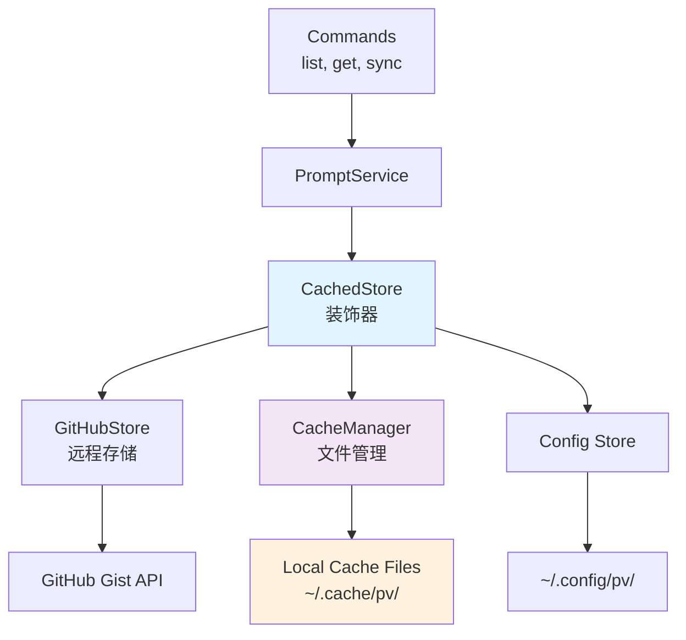

# 离线缓存功能设计文档

## 概述

离线缓存功能为 Prompt Vault 添加本地缓存层，实现"远程优先，缓存回退"的策略。该功能通过装饰器模式扩展现有的 GitHubStore，添加 CacheManager 进行简单的文件管理，并修改现有命令以支持离线操作。设计遵循项目的清洁架构原则，保持简单性和可维护性。

## 指导文档对齐

### 技术标准 (tech.md)
- **清洁架构**：通过装饰器模式添加缓存层，保持层级分离
- **单一职责**：CacheManager 专注于文件读写，避免接口过度设计
- **错误处理策略**：使用现有的自定义错误类型和错误处理中间件
- **存储策略**：GitHub Gist 为主要存储，本地缓存为次要存储

### 项目结构 (structure.md)
- **文件组织**：在 `internal/infra/` 中添加 `cache_manager.go`
- **命名约定**：遵循现有的命名模式和代码组织
- **依赖注入**：通过 Wire 管理新增的缓存组件

## 代码复用分析

### 现有组件利用
- **类似 config.getConfigDir()**: 创建 getCacheDir() 函数，获取缓存目录 `~/.cache/pv/`
- **config.writeFileWithPermissions()**: 复用文件权限设置逻辑
- **model.Prompt**: 直接使用现有的提示词数据模型
- **model.Index**: 扩展用于缓存索引管理
- **infra.Store**: 通过装饰器模式集成缓存功能

### 集成点
- **GitHubStore**: 通过装饰器模式包装，添加缓存功能
- **PromptService**: 无需修改，透明使用缓存增强的 Store
- **cmd/list.go**: 添加 `--remote` 标志参数
- **cmd/get.go**: 集成快速同步逻辑
- **Wire 配置**: 添加 CacheManager 依赖注入

## 架构



## 组件和接口

### CachedStore (装饰器)
- **目的**: 为 GitHubStore 添加缓存层，实现远程优先策略
- **接口**: 实现完整的 `Store` 接口
- **依赖**: GitHubStore, CacheManager
- **复用**: 包装现有 GitHubStore，透明添加缓存功能

```go
type CachedStore struct {
    remote Store         // GitHubStore
    cache  *CacheManager // 文件管理器
    config config.Store  // 配置存储
}
```

### CacheManager (文件管理器)
- **目的**: 专门管理本地缓存文件的读写操作
- **接口**: 简单的文件操作方法，不继承 Store 接口
- **依赖**: config.Store (获取缓存目录)
- **复用**: 使用类似 getConfigDir() 的模式创建 getCacheDir() 和文件权限工具

```go
type CacheManager struct {
    cacheDir string
}

func (c *CacheManager) LoadIndex() (*model.Index, error)
func (c *CacheManager) SaveIndex(index *model.Index) error
func (c *CacheManager) LoadContent(gistID string) (string, error)
func (c *CacheManager) SaveContent(gistID, content string) error  // 直接保存原始内容
func (c *CacheManager) EnsureCacheDir() error
func (c *CacheManager) GetCacheInfo() (*CacheInfo, error)
```

### SyncCommand (新增命令)
- **目的**: 提供手动同步远程数据到本地缓存的命令
- **接口**: Cobra 命令结构
- **依赖**: PromptService
- **复用**: 遵循现有命令模式和依赖注入方式

## 数据模型

### CacheInfo (缓存信息)
```go
type CacheInfo struct {
    LastUpdated time.Time `json:"last_updated"`
    TotalPrompts int      `json:"total_prompts"`
    CacheSize   int64     `json:"cache_size_bytes"`
}
```

### 缓存索引文件 (复用现有 model.Index)
```go
// 直接使用现有的 model.Index
type Index struct {
    Prompts     []IndexedPrompt `json:"prompts"`
    LastUpdated time.Time       `json:"last_updated"`
}
```

### 缓存提示词存储 (直接存储原始内容)
```
缓存的提示词文件与 GitHub Gist 中的文件完全一致：
- 文件名：{gist_id}.yaml
- 内容：原始的 YAML 提示词内容，不添加任何包装
- 格式：与 Gist 中的文件格式完全相同
```

### 缓存文件结构
```
~/.cache/pv/
├── index.json          # 缓存索引文件 (model.Index)
├── cache_info.json     # 缓存统计信息
└── prompts/            # 提示词内容目录
    ├── {gist_id}.yaml  # 与 Gist 完全一致的原始 YAML 文件
    └── {gist_id}.yaml  # 不添加任何包装或元数据
```

## 缓存一致性保证

### 设计原则
1. **内容一致性**：缓存文件与 GitHub Gist 文件**完全一致**
2. **格式保持**：缓存的 `.yaml` 文件格式与原始文件相同
3. **直接使用**：缓存文件可以直接被 YAML 解析器处理
4. **元数据分离**：缓存时间等元数据存储在 index.json 中，不污染原始内容

### SaveContent() 实现细节
```go
func (c *CacheManager) SaveContent(gistID, content string) error {
    // 直接保存原始内容，不添加任何包装
    filename := fmt.Sprintf("%s.yaml", gistID)
    filepath := filepath.Join(c.cacheDir, "prompts", filename)
    
    // 使用与配置文件相同的权限设置
    return writeFileWithPermissions(filepath, []byte(content), 0600)
}
```

## CachedStore 核心逻辑

### List() 方法流程
```go
func (c *CachedStore) List() ([]model.Prompt, error) {
    // 1. 如果是 list --remote，直接调用远程
    if c.forceRemote {
        prompts, err := c.remote.List()
        if err == nil {
            c.cache.SaveIndex(buildIndex(prompts)) // 更新缓存
        }
        return prompts, err
    }
    
    // 2. 尝试从远程获取
    prompts, err := c.remote.List()
    if err == nil {
        c.cache.SaveIndex(buildIndex(prompts)) // 更新缓存
        return prompts, nil
    }
    
    // 3. 远程失败，回退到缓存
    index, cacheErr := c.cache.LoadIndex()
    if cacheErr != nil {
        return nil, fmt.Errorf("remote failed and no cache available: %w", err)
    }
    
    return convertIndexToPrompts(index), nil
}
```

### GetContent() 方法流程
```go
func (c *CachedStore) GetContent(gistID string) (string, error) {
    // 1. 尝试从远程获取
    content, err := c.remote.GetContent(gistID)
    if err == nil {
        // 直接保存原始 YAML 内容，不添加任何包装
        c.cache.SaveContent(gistID, content) 
        return content, nil
    }
    
    // 2. 远程失败，回退到缓存
    // 返回与 Gist 完全一致的原始内容
    return c.cache.LoadContent(gistID)
}
```

## 错误处理

### 错误场景
1. **缓存目录创建失败**
   - **处理**: 回退到仅远程模式，显示警告
   - **用户影响**: 不影响基本功能，但无法离线使用

2. **缓存文件损坏**
   - **处理**: 忽略损坏的缓存文件，从远程重新获取
   - **用户影响**: 略微延迟，但不影响数据完整性

3. **磁盘空间不足**
   - **处理**: 显示错误信息，建议用户清理磁盘空间
   - **用户影响**: 无法保存新的缓存，但可以使用现有缓存

4. **网络完全不可用**
   - **处理**: 完全依赖本地缓存，显示离线模式提示
   - **用户影响**: 只能访问已缓存的内容

## 测试策略

### 单元测试
- **CacheManager**: 测试文件读写操作的各种边界情况
- **CachedStore**: 测试装饰器逻辑和回退机制
- **目录创建**: 测试缓存目录初始化和权限设置

### 集成测试
- **命令集成**: 测试 list, get, sync 命令的缓存行为
- **网络模拟**: 模拟网络失败情况的回退逻辑
- **文件系统**: 测试磁盘空间不足和权限问题

### 端到端测试
- **离线场景**: 完全断网情况下的用户体验
- **同步流程**: 从空缓存到完整同步的完整流程
- **混合使用**: 远程和缓存混合使用的真实场景