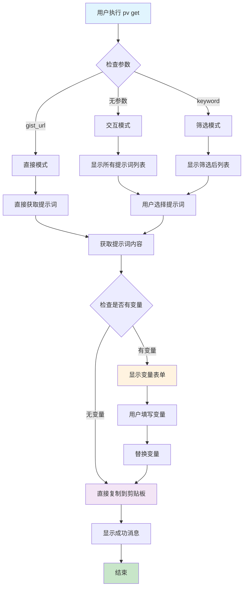

# 设计文档

## 功能名称
feature-get-command

## 架构概述

`get` 命令将遵循现有的 CLI 架构模式，复用删除命令的核心组件，并添加新的变量处理和剪贴板功能。整体架构保持与现有命令的一致性。

## 核心组件设计

### 1. 命令层 (cmd/get.go)

#### GetCommand 结构体
```go
type get struct {
    store         infra.Store
    promptService service.PromptService
    clipboardUtil clipboard.Util    // 新增：剪贴板工具
    variableParser variable.Parser  // 新增：变量解析器
}
```

#### 命令执行流程
```go
func (g *get) execute(cmd *cobra.Command, args []string) error {
    // 1. 根据参数数量决定执行模式
    switch len(args) {
    case 0:
        return g.handleInteractiveMode()
    case 1:
        if g.isGistURL(args[0]) {
            return g.handleDirectMode(args[0])
        }
        return g.handleFilterMode(args[0])
    default:
        return errors.New("参数过多")
    }
}
```

### 2. 服务层扩展 (internal/service/)

#### PromptService 接口重构
```go
type PromptService interface {
    // 文件操作
    AddFromFile(filePath string) (*model.Prompt, error)
    
    // 删除操作（保持向后兼容）
    DeleteByKeyword(keyword string) error
    DeleteByURL(gistURL string) error
    
    // 重构：通用数据访问方法（支持多个命令复用）
    ListPrompts() ([]model.Prompt, error)              // 重构：ListForDeletion -> ListPrompts
    FilterPrompts(keyword string) ([]model.Prompt, error) // 重构：FilterForDeletion -> FilterPrompts
    
    // 新增：获取单个提示词和内容
    GetPromptByURL(gistURL string) (*model.Prompt, error)
    GetPromptContent(prompt *model.Prompt) (string, error)
}
```

**重构说明：**
- `ListForDeletion()` → `ListPrompts()` - 更通用的命名，支持 list、delete、get 命令
- `FilterForDeletion(keyword)` → `FilterPrompts(keyword)` - 更通用的命名
- `GetByURL()` → `GetPromptByURL()` - 命名更明确
- 保持 `DeleteByKeyword` 和 `DeleteByURL` 方法不变，确保向后兼容

### 3. TUI 层扩展 (internal/tui/)

#### TUIInterface 接口扩展
```go
type TUIInterface interface {
    // 现有方法...
    ShowPromptList(prompts []model.Prompt) (model.Prompt, error)
    ShowConfirm(prompt model.Prompt) (bool, error)
    
    // 新增方法
    ShowVariableForm(variables []string) (map[string]string, error)
}
```

#### 新增：VariableFormModel
```go
type VariableFormModel struct {
    variables    []string
    values       map[string]string
    currentField int
    inputs       []textinput.Model
    done         bool
    cancelled    bool
    err          error
}
```

### 4. 新增组件

#### 变量解析器 (internal/variable/parser.go)
```go
type Parser interface {
    ExtractVariables(content string) []string
    ReplaceVariables(content string, values map[string]string) string
    HasVariables(content string) bool
}

type parser struct{}

func (p *parser) ExtractVariables(content string) []string {
    // 使用正则表达式提取 {variable} 模式
    re := regexp.MustCompile(`\{([^}]+)\}`)
    matches := re.FindAllStringSubmatch(content, -1)
    
    // 去重并返回变量名列表
    variables := make(map[string]bool)
    for _, match := range matches {
        if len(match) > 1 {
            variables[match[1]] = true
        }
    }
    
    result := make([]string, 0, len(variables))
    for variable := range variables {
        result = append(result, variable)
    }
    sort.Strings(result)
    return result
}
```

#### 剪贴板工具 (internal/clipboard/util.go)
```go
type Util interface {
    Copy(content string) error
    IsAvailable() bool
}

type util struct{}

func (u *util) Copy(content string) error {
    // 跨平台剪贴板实现
    // 可以使用 github.com/atotto/clipboard 库
    return clipboard.WriteAll(content)
}
```

## 执行流程设计

### 流程图



### 详细执行步骤

#### 1. 交互模式 (pv get)
```go
func (g *get) handleInteractiveMode() error {
    // 1. 获取所有提示词（使用重构后的通用方法）
    prompts, err := g.promptService.ListPrompts()
    if err != nil {
        return err
    }
    
    // 2. 显示选择界面 (复用现有 TUI)
    selected, err := g.showPromptSelection(prompts)
    if err != nil {
        return err
    }
    
    // 3. 处理选中的提示词
    return g.processSelectedPrompt(selected)
}
```

#### 2. 筛选模式 (pv get <keyword>)
```go
func (g *get) handleFilterMode(keyword string) error {
    // 1. 筛选提示词（使用重构后的通用方法）
    prompts, err := g.promptService.FilterPrompts(keyword)
    if err != nil {
        return err
    }
    
    if len(prompts) == 0 {
        return fmt.Errorf("未找到包含 '%s' 的提示词", keyword)
    }
    
    // 2. 显示筛选结果
    selected, err := g.showPromptSelection(prompts)
    if err != nil {
        return err
    }
    
    // 3. 处理选中的提示词
    return g.processSelectedPrompt(selected)
}
```

#### 3. 直接模式 (pv get <gist_url>)
```go
func (g *get) handleDirectMode(gistURL string) error {
    // 1. 直接获取提示词
    prompt, err := g.promptService.GetPromptByURL(gistURL)
    if err != nil {
        return err
    }
    
    // 2. 处理提示词
    return g.processSelectedPrompt(*prompt)
}
```

#### 4. 提示词处理流程
```go
func (g *get) processSelectedPrompt(prompt model.Prompt) error {
    // 1. 获取提示词内容
    content, err := g.promptService.GetPromptContent(&prompt)
    if err != nil {
        return err
    }
    
    // 2. 检查是否有变量
    if !g.variableParser.HasVariables(content) {
        // 无变量，直接复制
        return g.copyToClipboard(content, prompt.Name)
    }
    
    // 3. 有变量，显示表单
    variables := g.variableParser.ExtractVariables(content)
    values, err := g.showVariableForm(variables)
    if err != nil {
        return err
    }
    
    // 4. 替换变量
    finalContent := g.variableParser.ReplaceVariables(content, values)
    
    // 5. 复制到剪贴板
    return g.copyToClipboard(finalContent, prompt.Name)
}
```

## TUI 组件详细设计

### VariableFormModel 设计

#### 状态管理
```go
type VariableFormModel struct {
    variables    []string                 // 需要填写的变量列表
    inputs       []textinput.Model        // 输入框列表
    currentField int                      // 当前选中的字段
    values       map[string]string        // 用户输入的值
    done         bool                     // 是否完成
    cancelled    bool                     // 是否取消
    err          error                    // 错误信息
    
    // 样式
    focusedStyle lipgloss.Style
    blurredStyle lipgloss.Style
    helpStyle    lipgloss.Style
}
```

#### 更新逻辑
```go
func (m VariableFormModel) Update(msg tea.Msg) (tea.Model, tea.Cmd) {
    switch msg := msg.(type) {
    case tea.KeyMsg:
        switch msg.String() {
        case "ctrl+c", "esc", "q":
            m.cancelled = true
            return m, tea.Quit
            
        case "enter":
            return m.handleEnter()
            
        case "tab", "down":
            return m.nextField()
            
        case "shift+tab", "up":
            return m.prevField()
        }
    }
    
    // 更新当前输入框
    return m.updateCurrentInput(msg)
}
```

#### 视图渲染
```go
func (m VariableFormModel) View() string {
    if m.err != nil {
        return fmt.Sprintf("错误: %v\n", m.err)
    }
    
    var b strings.Builder
    
    b.WriteString("请填写提示词中的变量:\n\n")
    
    for i, variable := range m.variables {
        style := m.blurredStyle
        if i == m.currentField {
            style = m.focusedStyle
        }
        
        b.WriteString(fmt.Sprintf("%s %s:\n", style.Render("▶"), variable))
        b.WriteString(m.inputs[i].View())
        b.WriteString("\n\n")
    }
    
    b.WriteString(m.helpStyle.Render("Tab: 下一字段 • Shift+Tab: 上一字段 • Enter: 确认 • Esc: 取消"))
    
    return b.String()
}
```

## 依赖注入配置

### Wire 提供者扩展 (internal/di/providers.go)
```go
// 新增提供者
func ProvideVariableParser() variable.Parser {
    return variable.NewParser()
}

func ProvideClipboardUtil() clipboard.Util {
    return clipboard.NewUtil()
}

// 扩展现有提供者
func ProvideTUIInterface(/* 现有参数 */) tui.TUIInterface {
    return tui.NewBubbleTeaTUI(/* 包含新的 VariableFormModel */)
}
```

### Wire 集合更新 (internal/di/wire.go)
```go
var CLISet = wire.NewSet(
    // 现有提供者...
    
    // 新增提供者
    ProvideVariableParser,
    ProvideClipboardUtil,
    
    // 更新的提供者
    ProvideTUIInterface,
)
```

## 错误处理设计

### 新增错误类型 (internal/errors/get_errors.go)
```go
type GetError struct {
    Operation string
    Cause     error
}

func (e *GetError) Error() string {
    return fmt.Sprintf("获取提示词失败: %s - %v", e.Operation, e.Cause)
}

// 具体错误类型
var (
    ErrNoPromptsFound     = &GetError{Operation: "查找提示词", Cause: errors.New("未找到任何提示词")}
    ErrInvalidGistURL     = &GetError{Operation: "解析URL", Cause: errors.New("无效的GitHub Gist URL")}
    ErrVariableRequired   = &GetError{Operation: "变量验证", Cause: errors.New("变量值不能为空")}
    ErrClipboardUnavailable = &GetError{Operation: "剪贴板操作", Cause: errors.New("剪贴板不可用")}
)
```

## 测试策略

### 单元测试覆盖
1. **变量解析器测试**
   - 正确提取各种格式的变量
   - 处理嵌套和特殊字符
   - 变量替换功能

2. **命令逻辑测试**
   - 三种模式的参数解析
   - URL 验证逻辑
   - 错误处理流程

3. **TUI 组件测试**
   - VariableFormModel 状态管理
   - 用户输入处理
   - 表单验证逻辑

### 集成测试
1. **端到端流程测试**
   - 完整的获取和复制流程
   - 变量替换端到端测试
   - 不同操作系统的剪贴板测试

2. **TUI 交互测试**
   - 使用 go-expect 测试终端交互
   - 模拟用户输入和导航

## 性能考虑

### 优化策略
1. **缓存机制**
   - 复用现有的提示词列表缓存
   - 变量解析结果缓存

2. **异步处理**
   - 剪贴板操作异步化
   - TUI 响应性优化

3. **内存管理**
   - 及时释放大文本内容
   - 输入框状态优化

## 安全考虑

### 数据安全
1. **输入验证**
   - URL 格式验证
   - 变量名安全检查

2. **错误信息**
   - 避免敏感信息泄露
   - 用户友好的错误提示

## 总结

设计遵循现有架构模式，最大化复用现有组件，重点添加变量处理和剪贴板功能。整体设计保持了代码的一致性和可维护性，同时为新功能提供了清晰的扩展路径。