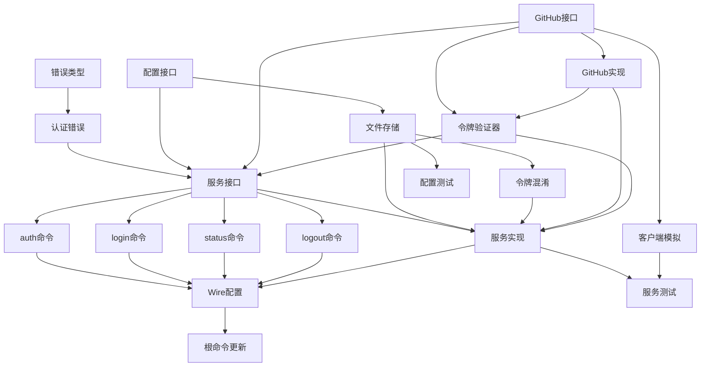

# 实现任务 - github-auth-process

## 任务分解

### 1. 基础设施层 - 错误处理

- [x] 1.1. 创建自定义错误类型 (需求: TC1, SC1)
  - 创建 `internal/errors/errors.go`
  - 定义 AppError 结构体和错误类型枚举

- [x] 1.2. 创建认证相关错误定义 (需求: AC2, AC6)
  - 创建 `internal/errors/auth_errors.go`
  - 定义 ErrInvalidToken, ErrMissingScope, ErrTokenNotFound

### 2. 基础设施层 - 配置存储

- [x] 2.1. 创建配置存储接口 (需求: US2, TC3)
  - 创建 `internal/config/config.go`
  - 定义 Store 接口和 Config 结构体

- [x] 2.2. 实现文件配置存储 (需求: AC3, SC2, TC2)
  - 创建 `internal/config/store.go`
  - 实现 fileStore，处理跨平台文件权限

- [x] 2.3. 实现令牌混淆功能 (需求: AC3, SC2)
  - 创建 `internal/config/obfuscate.go`
  - 实现简单的 XOR 混淆算法

### 3. 基础设施层 - GitHub 集成

- [x] 3.1. 创建 GitHub 客户端接口 (需求: US3, D1)
  - 创建 `internal/auth/github_client.go`
  - 定义 GitHubClient 接口和 User 结构体

- [x] 3.2. 实现 GitHub API 调用 (需求: AC2, SC3, PR1)
  - 创建 `internal/auth/github_client_impl.go`
  - 实现 GetAuthenticatedUser 和 ValidateScopes 方法

- [x] 3.3. 创建令牌验证器 (需求: US3, AC2)
  - 创建 `internal/auth/token_validator.go`
  - 实现 TokenValidator 接口和验证逻辑

### 4. 服务层

- [x] 4.1. 创建认证服务接口 (需求: US1, US4)
  - 创建 `internal/service/auth_service.go`
  - 定义 AuthService 接口和 AuthStatus 结构体

- [x] 4.2. 实现认证服务 (需求: AC1, AC4, AC5)
  - 创建 `internal/service/auth_service_impl.go`
  - 实现 Login, GetStatus, Logout 方法

### 5. CLI 层 - 命令实现

- [x] 5.1. 创建 auth 父命令 (需求: US1)
  - 创建 `cmd/auth.go`
  - 创建 auth 命令容器

- [x] 5.2. 实现 login 子命令 (需求: AC1, US1)
  - 创建 `cmd/auth_login.go`
  - 实现令牌输入和登录流程

- [x] 5.3. 实现 status 子命令 (需求: AC4, US4)
  - 创建 `cmd/auth_status.go`
  - 显示认证状态

- [x] 5.4. 实现 logout 子命令 (需求: AC5)
  - 创建 `cmd/auth_logout.go`
  - 清除存储的认证信息

### 6. 依赖注入配置

- [x] 6.1. 更新 Wire 配置 (需求: TC3)
  - 修改 `internal/di/wire.go`
  - 添加新的提供者函数

- [x] 6.2. 更新根命令注册 (需求: TC3)
  - 修改 `cmd/root.go`
  - 在 NewRootCommand 中添加 auth 命令

### 7. 测试

- [x] 7.1. 创建配置存储单元测试 (需求: TC2)
  - 创建 `internal/config/store_test.go`
  - 测试文件权限和跨平台兼容性

- [x] 7.2. 创建 GitHub 客户端模拟 (需求: US3)
  - 创建 `internal/auth/github_client_mock.go`
  - 用于服务层测试

- [x] 7.3. 创建认证服务单元测试 (需求: AC1, AC4, AC5)
  - 创建 `internal/service/auth_service_test.go`
  - 测试所有认证流程

## 任务依赖关系

## 关键路径

1. **基础设施准备**（Task 1.1 - 3.3）：创建所有接口和基础实现
2. **服务层实现**（Task 4.1 - 4.2）：实现核心业务逻辑
3. **CLI 集成**（Task 5.1 - 6.2）：创建用户界面
4. **测试验证**（Task 7.1 - 7.3）：确保功能正确性

## 测试任务

- [ ] **单元测试**：每个组件的独立测试
- [ ] **集成测试**：测试组件间的协作
- [ ] **手动测试**：验证命令行交互体验

## 文档任务

- [ ] **更新 README.md**：添加认证使用说明
- [ ] **创建 AUTH.md**：详细的认证配置指南