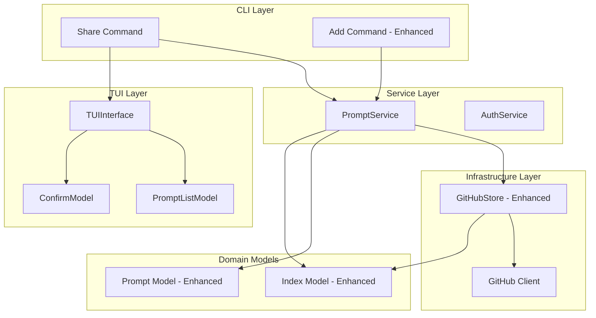
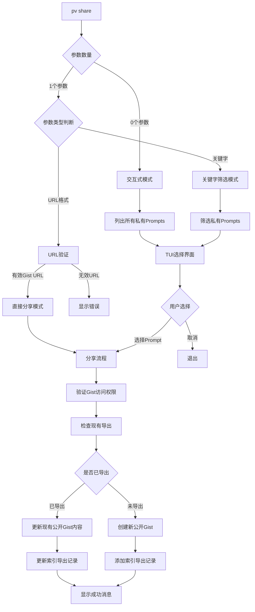
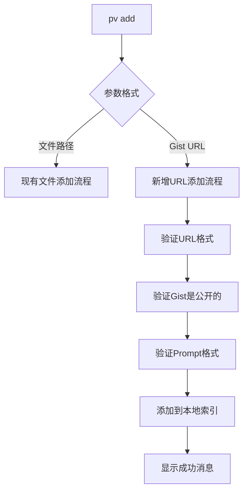
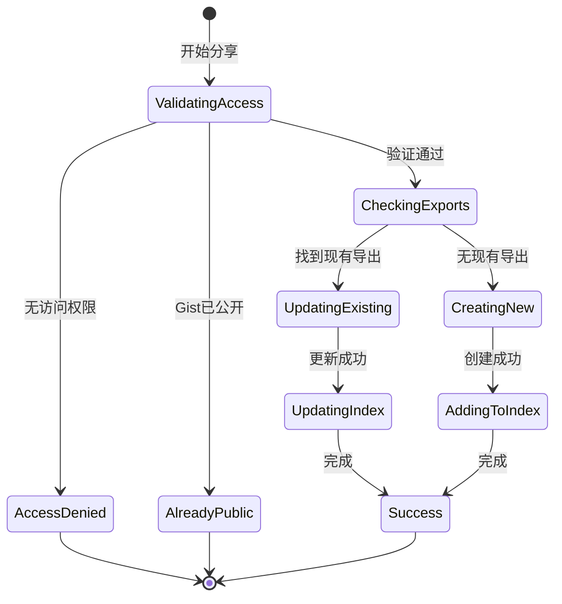

# Share 命令设计文档

## 设计概述
Share 命令将扩展现有的 Prompt Vault 架构，添加将私有 GitHub Gists 转换为公开 Gists 的功能。设计遵循现有的清洁架构模式，重用 TUI 组件和服务层接口。

## 架构决策

### AD1: 重用现有 TUI 模式
**决策**: 使用与 `pv delete` 命令相同的三模式交互模式
**理由**: 
- 保持用户体验一致性
- 重用已测试的 TUI 组件
- 减少开发和维护成本

### AD2: 扩展现有数据模型
**决策**: 在现有 Prompt 和 Index 模型基础上添加字段而非创建新模型
**理由**:
- 维持向后兼容性
- 避免数据迁移复杂性
- 保持现有序列化/反序列化逻辑

### AD3: 服务层职责分离
**决策**: 在 PromptService 中添加 share 相关方法，在 Store 接口中添加 gist 可见性管理
**理由**:
- 遵循单一职责原则
- 维持现有接口的稳定性
- 便于单元测试

## 系统架构

### 整体架构图


## 数据模型设计

### 增强的 Prompt 模型
```go
type Prompt struct {
    ID          string   `json:"id"`
    Name        string   `json:"name"`
    Author      string   `json:"author"`
    GistURL     string   `json:"gist_url"`
    Description string   `json:"description"`
    Tags        []string `json:"tags"`
    Version     string   `json:"version"`
    Content     string   `json:"content"`
    Parent      *string  `json:"parent,omitempty"`  // 新增：父级 Prompt 的 gist URL
}
```

### 增强的 Index 模型
```go
type Index struct {
    Prompts     []IndexedPrompt `json:"prompts"`
    LastUpdated time.Time       `json:"last_updated"`
    Exports     []IndexedPrompt `json:"exports"`  // 新增：已分享的公开 Prompt 列表
}
```

### 增强的 IndexedPrompt 模型
```go
type IndexedPrompt struct {
    GistURL     string    `json:"gist_url"`
    FilePath    string    `json:"file_path"`
    Author      string    `json:"author"`
    Name        string    `json:"name"`
    LastUpdated time.Time `json:"last_updated"`
    Parent      *string   `json:"parent,omitempty"`  // 新增：父级 Prompt 的 gist URL（仅用于 exports）
}
```

### GitHub API 约束说明
由于 GitHub API 不支持修改现有 gist 的可见性（private → public），share 命令的行为如下：

1. **首次分享**: 创建新的公开 gist
2. **再次分享**: 更新已存在的公开 gist 内容（而非创建新的）
3. **原始私有 gist**: 始终保持不变，不受分享影响

这样可以确保每个私有 prompt 只有一个对应的公开分享版本，避免创建过多的重复 gist。

## 接口设计

### 增强的 PromptService 接口
```go
type PromptService interface {
    // 现有方法...
    AddFromFile(filePath string) (*model.Prompt, error)
    DeleteByKeyword(keyword string) error
    DeleteByURL(gistURL string) error
    ListPrompts() ([]model.Prompt, error)
    FilterPrompts(keyword string) ([]model.Prompt, error)
    GetPromptByURL(gistURL string) (*model.Prompt, error)
    GetPromptContent(prompt *model.Prompt) (string, error)
    
    // 新增方法
    SharePrompt(prompt *model.Prompt) (*model.Prompt, error)
    AddFromURL(gistURL string) (*model.Prompt, error)
    ValidateGistAccess(gistURL string) (*GistInfo, error)
    ListPrivatePrompts() ([]model.Prompt, error)
    FilterPrivatePrompts(keyword string) ([]model.Prompt, error)
}

type GistInfo struct {
    ID          string
    URL         string
    IsPublic    bool
    HasAccess   bool
    Description string
    Owner       string
}
```

### 增强的 Store 接口
```go
type Store interface {
    // 现有方法...
    List() ([]model.Prompt, error)
    Add(model.Prompt) error
    Delete(keyword string) error
    Update(model.Prompt) error
    Get(keyword string) ([]model.Prompt, error)
    GetContent(gistID string) (string, error)
    
    // 新增方法
    CreatePublicGist(prompt model.Prompt) (string, error)
    UpdateGist(gistURL string, prompt model.Prompt) error
    GetGistInfo(gistURL string) (*GistInfo, error)
    AddExport(prompt model.IndexedPrompt) error
    UpdateExport(prompt model.IndexedPrompt) error
    GetExports() ([]model.IndexedPrompt, error)
}
```

## 命令设计

### Share 命令架构


### 增强的 Add 命令架构


## TUI 组件复用

### 重用现有组件
1. **TUIInterface**: 直接重用现有接口
2. **PromptListModel**: 重用用于显示私有 Prompts 列表
3. **ConfirmModel**: 重用用于分享确认对话框
4. **ErrorModel**: 重用用于错误消息显示

### 筛选逻辑适配
```go
// 复用现有筛选逻辑，但仅针对私有 gists
func (ps *PromptServiceImpl) FilterPrivatePrompts(keyword string) ([]model.Prompt, error) {
    allPrompts, err := ps.ListPrivatePrompts()
    if err != nil {
        return nil, err
    }
    
    return filterPromptsByKeyword(allPrompts, keyword), nil
}

func (ps *PromptServiceImpl) ListPrivatePrompts() ([]model.Prompt, error) {
    allPrompts, err := ps.ListPrompts()
    if err != nil {
        return nil, err
    }
    
    var privatePrompts []model.Prompt
    for _, prompt := range allPrompts {
        gistInfo, err := ps.store.GetGistInfo(prompt.GistURL)
        if err != nil {
            continue // 跳过无法访问的 gist
        }
        if !gistInfo.IsPublic {
            privatePrompts = append(privatePrompts, prompt)
        }
    }
    
    return privatePrompts, nil
}
```

## 分享流程设计

### 分享流程状态机


### 关键分享逻辑
```go
func (ps *PromptServiceImpl) SharePrompt(prompt *model.Prompt) (*model.Prompt, error) {
    // 1. 验证访问权限
    gistInfo, err := ps.store.GetGistInfo(prompt.GistURL)
    if err != nil {
        return nil, apperrors.NewAppError(apperrors.ErrNetwork, "无法访问 Gist", err)
    }
    
    if gistInfo.IsPublic {
        return nil, apperrors.NewAppError(apperrors.ErrValidation, "不需要分享公开 Gist", nil)
    }
    
    if !gistInfo.HasAccess {
        return nil, apperrors.NewAppError(apperrors.ErrPermission, "没有访问权限", nil)
    }
    
    // 2. 检查现有导出
    exports, err := ps.store.GetExports()
    if err != nil {
        return nil, err
    }
    
    var existingExport *model.IndexedPrompt
    for _, export := range exports {
        if export.Parent != nil && *export.Parent == prompt.GistURL {
            exportCopy := export // 避免循环变量地址问题
            existingExport = &exportCopy
            break
        }
    }
    
    // 3. 创建或更新公开 Gist
    var gistURL string
    var sharedPrompt *model.Prompt
    
    if existingExport != nil {
        // 更新现有公开 gist 的内容
        err = ps.store.UpdateGist(existingExport.GistURL, *prompt)
        if err != nil {
            return nil, err
        }
        gistURL = existingExport.GistURL
        
        // 更新导出记录的时间戳
        existingExport.LastUpdated = time.Now()
        err = ps.store.UpdateExport(*existingExport)
        if err != nil {
            return nil, err
        }
        
        // 转换为完整的 Prompt 对象返回
        sharedPrompt = &model.Prompt{
            ID:          extractGistID(gistURL),
            Name:        existingExport.Name,
            Author:      existingExport.Author,
            GistURL:     gistURL,
            Description: prompt.Description,
            Tags:        prompt.Tags,
            Version:     prompt.Version,
            Content:     prompt.Content,
            Parent:      existingExport.Parent,
        }
    } else {
        // 创建新的公开 gist
        gistURL, err = ps.store.CreatePublicGist(*prompt)
        if err != nil {
            return nil, err
        }
        
        // 创建新的导出记录
        exportRecord := model.IndexedPrompt{
            GistURL:     gistURL,
            FilePath:    "", // exports 不需要本地文件路径
            Author:      prompt.Author,
            Name:        prompt.Name,
            LastUpdated: time.Now(),
            Parent:      &prompt.GistURL,
        }
        
        err = ps.store.AddExport(exportRecord)
        if err != nil {
            return nil, err
        }
        
        // 返回完整的 Prompt 对象
        sharedPrompt = &model.Prompt{
            ID:          extractGistID(gistURL),
            Name:        prompt.Name,
            Author:      prompt.Author,
            GistURL:     gistURL,
            Description: prompt.Description,
            Tags:        prompt.Tags,
            Version:     prompt.Version,
            Content:     prompt.Content,
            Parent:      &prompt.GistURL,
        }
    }
    
    return sharedPrompt, nil
}
```

## 错误处理设计

### 新增错误类型
```go
// internal/errors/share_errors.go
package apperrors

import "fmt"

var (
    // Share 相关错误
    ErrGistAlreadyPublic = NewAppError(ErrValidation, "Gist 已经是公开的", nil)
    ErrGistAccessDenied  = NewAppError(ErrPermission, "没有访问 Gist 的权限", nil)
    ErrInvalidGistURL    = NewAppError(ErrValidation, "无效的 Gist URL", nil)
    ErrGistNotFound      = NewAppError(ErrNotFound, "找不到指定的 Gist", nil)
    
    // Add URL 相关错误
    ErrGistNotPublic     = NewAppError(ErrValidation, "只能导入公开的 Gist", nil)
    ErrInvalidPromptFormat = NewAppError(ErrValidation, "无效的 Prompt 格式", nil)
)

func NewShareError(operation string, gistURL string, cause error) *AppError {
    message := fmt.Sprintf("分享操作失败: %s (%s)", operation, gistURL)
    return NewAppError(ErrStorage, message, cause)
}

func NewAddFromURLError(reason string, gistURL string, cause error) *AppError {
    message := fmt.Sprintf("从 URL 添加失败: %s (%s)", reason, gistURL)
    return NewAppError(ErrValidation, message, cause)
}
```

## 测试策略

### 单元测试覆盖
1. **Service 层测试**: 
   - SharePrompt 方法的各种场景
   - AddFromURL 方法的验证逻辑
   - 权限验证逻辑

2. **Store 层测试**:
   - GitHub API 集成测试
   - Gist 可见性检查
   - 导出管理功能

3. **Command 层测试**:
   - 三种模式的参数解析
   - 错误场景处理

### 集成测试
1. **TUI 交互测试**: 使用现有的 vt10x 框架
2. **GitHub API 测试**: 使用 mock 和真实 API 测试
3. **端到端工作流测试**: 完整的分享流程

## 性能考虑

### 缓存策略
1. **Gist 信息缓存**: 短期缓存 gist 可见性信息避免重复 API 调用
2. **私有 Prompts 筛选**: 批量检查而非逐个验证

### GitHub API 优化
1. **批量操作**: 尽可能使用批量 API 调用
2. **速率限制处理**: 实现指数退避重试机制
3. **并发控制**: 限制并发 API 请求数量

## 部署考虑

### 向后兼容性
1. **数据迁移**: 新字段使用可选类型，避免破坏现有数据
2. **API 兼容**: 现有接口保持不变，仅添加新方法
3. **配置兼容**: 不引入新的必需配置项

### GitHub API 限制的影响
1. **Gist 数量**: 每个私有 prompt 只会对应一个公开 gist，数量可控
2. **内容更新**: 再次分享会更新现有公开 gist 的内容
3. **用户提示**: 在 UI 中清楚说明分享行为（首次创建，再次更新）

### 渐进式发布
1. **功能开关**: 可通过配置控制 share 功能的启用
2. **监控指标**: 添加分享操作的成功率和性能监控
3. **回滚能力**: 确保可以快速禁用新功能

## 安全考虑

### 权限验证
1. **GitHub 权限**: 验证用户对 gist 的读写权限
2. **URL 验证**: 严格验证 gist URL 格式防止注入攻击
3. **内容过滤**: 验证导入内容的安全性

### 数据保护
1. **敏感信息**: 确保不在日志中记录敏感的 gist 内容
2. **错误信息**: 避免在错误消息中泄露敏感信息
3. **访问控制**: 确保用户只能访问自己有权限的 gist

这个设计文档基于现有架构，重用了大量现有组件，同时添加了必要的新功能。设计遵循了清洁架构原则，保持了向后兼容性，并考虑了性能、安全和可测试性。