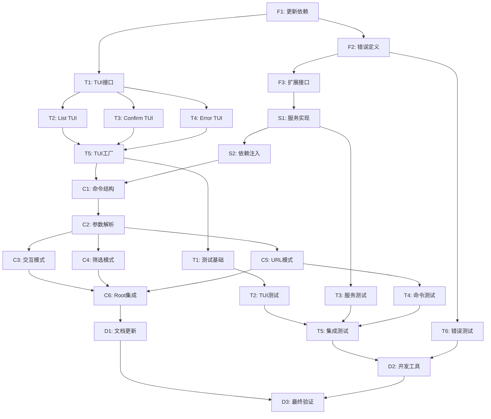

# Tasks: Prompt Vault Delete 功能任务分解

## 任务执行原则

每个任务都是原子化的，可以独立执行和测试。任务按依赖关系排序，确保每个任务完成后系统处于稳定状态。所有任务都引用具体的需求和设计文档部分。

## 第一阶段：依赖和基础设施 (Foundation)

### 📦 F1: 更新项目依赖
**需求引用**: 非功能性需求 → 技术要求 → 依赖管理  
**设计引用**: 部署和维护 → 依赖管理  
**文件**: `go.mod`, `go.sum`  
**执行时间**: 10-15分钟  

- [x] 在 `go.mod` 中添加 bubbletea 相关依赖
  - `github.com/charmbracelet/bubbletea@latest`
  - `github.com/charmbracelet/lipgloss@latest` (样式支持)
- [x] 添加测试依赖
  - `github.com/Netflix/go-expect@latest` (TTY测试)
  - `github.com/hinshun/vt10x@latest` (虚拟终端)
- [x] 运行 `go mod tidy` 更新依赖
- [x] 验证编译: `go build -o pv`

### 🔧 F2: 创建删除错误定义
**需求引用**: 错误处理需求 → 错误场景  
**设计引用**: 错误处理设计 → 错误分类和处理策略  
**文件**: `internal/errors/delete_errors.go`  
**执行时间**: 15-20分钟  

- [x] 创建 `internal/errors/delete_errors.go` 文件
- [x] 定义删除相关错误变量:
  - `ErrPromptNotFound` - 未找到提示错误
  - `ErrDeleteCancelled` - 用户取消删除
  - `ErrDeleteFailed` - 删除操作失败  
  - `ErrInvalidGistURL` - 无效URL格式
  - `ErrGitHubPermission` - GitHub权限错误
- [x] 为每个错误添加中文友好消息
- [x] 编写错误创建的辅助函数

### 🏗️ F3: 扩展 PromptService 接口
**需求引用**: 用户故事 → 所有删除相关故事  
**设计引用**: 服务层集成 → PromptService 扩展  
**文件**: `internal/service/prompt_service.go`  
**执行时间**: 10-15分钟  

- [x] 在 `PromptService` 接口中添加删除方法:
  - `DeleteByKeyword(keyword string) error`
  - `DeleteByURL(gistURL string) error`  
  - `ListForDeletion() ([]model.Prompt, error)`
  - `FilterForDeletion(keyword string) ([]model.Prompt, error)`
- [x] 添加方法的详细注释说明用途和参数

## 第二阶段：TUI 组件开发 (TUI Components)

### 🎨 T1: 创建 TUI 接口定义
**需求引用**: 非功能性需求 → 用户体验要求 → 交互性  
**设计引用**: 测试策略设计 → TTY测试解决方案 → Mock TUI接口  
**文件**: `internal/tui/interface.go`  
**执行时间**: 10-15分钟  

- [x] 创建 `internal/tui/` 目录
- [x] 在 `internal/tui/interface.go` 中定义 `TUIInterface`:
  - `ShowPromptList(prompts []model.Prompt) (model.Prompt, error)`
  - `ShowConfirm(prompt model.Prompt) (bool, error)`
- [x] 定义 TUI 相关的常量和类型:
  - `ListMode` 枚举 (ListAll, ListFiltered)
  - 键盘快捷键常量

### 🎯 T2: 实现 Prompt List TUI 模型
**需求引用**: 用户故事 → 交互式列表删除, 关键字筛选删除  
**设计引用**: TUI组件设计 → Prompt List TUI  
**文件**: `internal/tui/prompt_list.go`  
**执行时间**: 25-30分钟  

- [x] 创建 `PromptListModel` 结构体和相关类型
- [x] 实现 bubbletea Model 接口:
  - `Init() tea.Cmd` - 初始化模型
  - `Update(tea.Msg) (tea.Model, tea.Cmd)` - 处理用户输入
  - `View() string` - 渲染界面
- [x] 实现键盘导航逻辑 (上下箭头、回车、q退出)
- [x] 实现列表显示格式: `[数字] 提示名称 (作者: 作者名)`
- [x] 处理空列表和加载状态

### ✅ T3: 实现 Confirmation TUI 模型  
**需求引用**: 用户故事 → 所有删除故事的确认机制  
**设计引用**: TUI组件设计 → Confirmation TUI  
**文件**: `internal/tui/confirm.go`  
**执行时间**: 20-25分钟  

- [x] 创建 `ConfirmModel` 结构体
- [x] 实现 bubbletea Model 接口
- [x] 设计确认界面布局显示提示详细信息
- [x] 实现 Y/N 确认逻辑和 ESC 取消
- [x] 添加警告样式和提示信息
- [x] 处理用户输入验证

### 🎪 T4: 实现 TUI 错误显示组件
**需求引用**: 错误处理需求 → 错误处理策略 → 友好消息  
**设计引用**: 错误处理设计 → TUI错误显示  
**文件**: `internal/tui/error.go`  
**执行时间**: 15-20分钟  

- [x] 创建 `ErrorModel` 结构体
- [x] 实现错误信息显示界面  
- [x] 设计错误界面布局和样式
- [x] 实现按键继续逻辑
- [x] 添加不同错误类型的图标和颜色

### 🏭 T5: 实现 TUI 工厂和集成
**需求引用**: 所有 TUI 相关用户故事  
**设计引用**: TUI组件设计 → 整体集成  
**文件**: `internal/tui/factory.go`  
**执行时间**: 15-20分钟  

- [x] 创建 `BubbleTeaTUI` 结构体实现 `TUIInterface`
- [x] 实现 `ShowPromptList` 方法，启动列表选择界面
- [x] 实现 `ShowConfirm` 方法，启动确认界面  
- [x] 添加 TUI 程序启动和清理逻辑
- [x] 处理 TUI 运行时错误和退出条件

## 第三阶段：服务层实现 (Service Layer)

### 🔧 S1: 实现 PromptService 删除方法
**需求引用**: 用户故事 → 所有删除功能  
**设计引用**: 服务层集成 → 实现逻辑  
**文件**: `internal/service/prompt_service_impl.go`  
**执行时间**: 25-30分钟  

- [x] 在 `PromptServiceImpl` 中实现 `DeleteByKeyword` 方法:
  - 使用 `Store.Get()` 查找匹配的提示
  - 验证找到的提示数量和权限
  - 调用 `Store.Delete()` 执行删除
- [x] 实现 `DeleteByURL` 方法:
  - 从URL提取Gist ID
  - 验证URL格式和有效性
  - 执行删除操作
- [x] 实现辅助方法 `ListForDeletion` 和 `FilterForDeletion`
- [x] 添加详细的错误处理和日志记录

### 🔗 S2: 更新依赖注入配置
**需求引用**: 用户故事 → 故事4: 删除别名支持  
**设计引用**: 依赖注入更新  
**文件**: `internal/di/providers.go`  
**执行时间**: 10-15分钟  

- [x] 在 `Commands` 结构体中添加 `DeleteCmd *cobra.Command`
- [x] 更新 `ProvideCommands` 函数:
  - 调用 `cmd.NewDeleteCommand` 创建删除命令
  - 将删除命令添加到返回的 Commands 结构中
- [x] 确保正确传递依赖参数 (store, promptService)

## 第四阶段：命令层实现 (Command Layer)

### 🖥️ C1: 创建 Delete 命令结构
**需求引用**: 用户故事 → 所有删除模式  
**设计引用**: Delete Command 核心职责  
**文件**: `cmd/delete.go`  
**执行时间**: 20-25分钟  

- [x] 创建 `delete` 结构体包含 store 和 promptService 依赖
- [x] 定义 `DeleteCmd` 类型别名
- [x] 实现 `NewDeleteCommand` 构造函数:
  - 配置 Cobra 命令参数 (Use, Short, Long)
  - 设置参数验证规则 (0-1个参数)
  - 绑定执行函数
- [x] 添加命令使用示例和帮助文本

### ⚡ C2: 实现参数解析和路由逻辑
**需求引用**: 用户故事 → 三种删除模式  
**设计引用**: 三种模式处理逻辑  
**文件**: `cmd/delete.go` (继续)  
**执行时间**: 20-25分钟  

- [x] 实现 `execute` 方法的参数解析:
  - 无参数 → 交互式模式
  - 关键字参数 → 筛选模式  
  - URL参数 → 直接删除模式
- [x] 添加URL格式验证 (GitHub Gist URL 正则表达式)
- [x] 实现模式路由到对应处理函数
- [x] 添加参数验证和错误处理

### 🎮 C3: 实现交互式删除模式
**需求引用**: 用户故事 → 交互式列表删除  
**设计引用**: 数据流设计 → 交互式删除流程  
**文件**: `cmd/delete.go` (继续)  
**执行时间**: 25-30分钟  

- [x] 实现 `handleInteractiveMode` 方法:
  - 调用 `promptService.ListForDeletion()` 获取所有提示
  - 处理空列表情况显示友好消息
  - 启动 TUI 提示选择界面
  - 获取用户选择的提示
- [x] 集成确认界面显示提示详情
- [x] 执行删除操作并显示结果
- [x] 添加完整错误处理链

### 🔍 C4: 实现关键字筛选删除模式
**需求引用**: 用户故事 → 关键字筛选删除  
**设计引用**: 数据流设计 → 关键字筛选删除流程  
**文件**: `cmd/delete.go` (继续)  
**执行时间**: 20-25分钟  

- [x] 实现 `handleFilterMode` 方法:
  - 调用 `promptService.FilterForDeletion(keyword)` 筛选提示
  - 处理无匹配结果情况
  - 显示筛选结果统计信息
  - 启动 TUI 选择界面
- [x] 优化筛选结果显示格式
- [x] 集成后续确认和删除流程
- [x] 添加筛选关键字高亮显示

### 🎯 C5: 实现 URL 直接删除模式
**需求引用**: 用户故事 → 直接URL删除  
**设计引用**: 数据流设计 → URL直接删除流程  
**文件**: `cmd/delete.go` (继续)  
**执行时间**: 20-25分钟  

- [x] 实现 `handleDirectMode` 方法:
  - 验证和解析 GitHub Gist URL
  - 调用 `promptService.DeleteByURL(url)` 查找提示
  - 处理提示不存在的情况
  - 直接显示确认界面（跳过列表选择）
- [x] 实现 URL 解析辅助功能
- [x] 添加 URL 格式验证和错误提示
- [x] 集成删除确认和执行逻辑

### 🔗 C6: 集成 Root 命令系统
**需求引用**: 用户故事 → 删除别名支持  
**设计引用**: Root Command 集成  
**文件**: `cmd/root.go`  
**执行时间**: 10-15分钟  

- [x] 更新 `addCommands` 方法:
  - 添加 `r.Command.AddCommand(commands.DeleteCmd)`
  - 创建 `del` 别名命令
  - 注册别名到根命令
- [x] 确保命令正确集成到帮助系统
- [x] 验证命令和别名都能正常工作

## 第五阶段：测试实现 (Testing)

### 🧪 T1: 创建 TUI 测试基础设施
**需求引用**: 非功能性需求 → 技术要求 → 测试支持  
**设计引用**: 测试策略设计 → TTY测试解决方案  
**文件**: `internal/tui/mock.go`, `internal/tui/testing_utils.go`  
**执行时间**: 25-30分钟  

- [x] 创建 `MockTUI` 结构体实现 `TUIInterface`:
  - 配置测试用的预设返回值
  - 记录方法调用历史
  - 模拟用户交互场景
- [x] 实现测试辅助函数:
  - 创建测试提示数据生成器
  - TUI状态验证辅助函数
  - 错误场景模拟器
- [x] 设置集成测试环境 (expect + vt10x)

### 🔬 T2: 编写 TUI 组件单元测试
**需求引用**: 质量标准 → 单元测试覆盖率达到80%以上  
**设计引用**: 测试策略设计 → 单元测试覆盖  
**文件**: `internal/tui/prompt_list_test.go`, `internal/tui/confirm_test.go`  
**执行时间**: 30-35分钟  

- [x] 测试 `PromptListModel`:
  - 初始化状态测试
  - 键盘导航逻辑测试 (上下箭头、回车)
  - 提示选择和退出逻辑测试
  - 空列表和错误状态处理测试
- [x] 测试 `ConfirmModel`:
  - 确认和取消操作测试
  - 键盘输入处理测试 (Y/N/Esc)
  - 提示信息显示测试
- [x] 添加边界条件和异常情况测试

### 🧮 T3: 编写服务层单元测试
**需求引用**: 质量标准 → 单元测试覆盖率达到80%以上  
**设计引用**: 测试策略设计 → 服务层删除方法测试  
**文件**: `internal/service/prompt_service_test.go` (扩展现有文件)  
**执行时间**: 25-30分钟  

- [x] 测试 `DeleteByKeyword` 方法:
  - 成功删除场景
  - 提示不存在场景  
  - Store 删除失败场景
  - 权限不足场景
- [x] 测试 `DeleteByURL` 方法:
  - 有效URL删除测试
  - 无效URL格式测试
  - URL对应提示不存在测试
- [x] 测试 `ListForDeletion` 和 `FilterForDeletion` 方法
- [x] 使用现有的 `MockStore` 和新增的 Mock 组件

### 🎛️ T4: 编写命令层单元测试
**需求引用**: 质量标准 → 单元测试覆盖率达到80%以上  
**设计引用**: 测试策略设计 → Delete命令参数解析测试  
**文件**: `cmd/delete_test.go`  
**执行时间**: 30-35分钟  

- [x] 测试命令创建和配置:
  - `NewDeleteCommand` 构造函数测试
  - 命令参数和标志配置测试
  - 帮助文本和使用说明测试
- [x] 测试参数解析逻辑:
  - 无参数解析测试  
  - 关键字参数解析测试
  - URL参数解析和验证测试
  - 无效参数处理测试
- [x] 测试三种模式的路由逻辑
- [x] 使用 MockTUI 和 MockPromptService 进行隔离测试

### 🌊 T5: 编写集成测试
**需求引用**: 质量标准 → 集成测试涵盖所有主要用户场景  
**设计引用**: 测试策略设计 → 集成测试覆盖  
**文件**: `integration/delete_test.go`  
**执行时间**: 35-40分钟  

- [x] 创建 `integration/` 测试目录
- [x] 实现完整删除工作流测试:
  - 端到端交互式删除测试 (使用 expect)
  - 关键字筛选删除集成测试
  - URL直接删除集成测试
- [x] 测试错误场景的完整流程:
  - 网络错误恢复测试
  - GitHub权限错误处理测试
  - 用户取消操作测试
- [x] 验证数据一致性 (GitHub + 本地索引)

### ✅ T6: 编写错误处理测试
**需求引用**: 错误处理需求 → 所有错误场景  
**设计引用**: 错误处理设计 → 错误分类和处理策略  
**文件**: `internal/errors/delete_errors_test.go`  
**执行时间**: 20-25分钟  

- [x] 测试所有删除错误类型的创建和格式化
- [x] 测试错误消息的本地化和友好性
- [x] 测试错误码和类型的正确分类
- [x] 测试错误包装和上下文传递
- [x] 验证错误处理策略的一致性

## 第六阶段：文档和集成 (Documentation & Integration)

### 📚 D1: 更新项目文档
**需求引用**: 成功标准 → 功能完整性文档更新  
**设计引用**: 文档更新需求  
**文件**: `README.md`, `CLAUDE.md`  
**执行时间**: 20-25分钟  

- [x] 更新 `README.md`:
  - 在功能列表中添加删除命令说明
  - 添加删除命令使用示例
  - 更新完整的命令参考表
- [x] 更新 `CLAUDE.md`:
  - 添加 bubbletea TUI 架构说明
  - 更新依赖列表包含新增依赖
  - 添加删除功能的测试指南
  - 更新开发命令包含新的测试命令

### 🔧 D2: 创建开发工具和脚本
**需求引用**: 成功标准 → 质量标准 → 测试要求  
**设计引用**: 部署和维护 → 构建配置  
**文件**: `scripts/test-tui.sh`, `Makefile`  
**执行时间**: 15-20分钟  

- [x] 创建 TUI 测试辅助脚本:
  - `scripts/test-tui.sh` - 运行TTY集成测试
  - 设置虚拟终端环境变量
  - 配置测试输出格式
- [x] 更新或创建 `Makefile`:
  - 添加 `make test-delete` 运行删除功能测试
  - 添加 `make test-tui` 运行TUI测试
  - 添加依赖安装目标

### 🎯 D3: 最终集成验证
**需求引用**: 验收测试场景 → 所有场景  
**设计引用**: 整体架构验证  
**文件**: 整个系统  
**执行时间**: 25-30分钟  

- [x] 验证完整构建流程:
  - `go build -o pv` 成功编译
  - 所有依赖正确解析
  - 无编译警告或错误
- [x] 手动验证所有用户场景:
  - `pv delete` 交互式删除
  - `pv delete keyword` 筛选删除
  - `pv delete <url>` 直接删除
  - `pv del` 别名功能
- [x] 验证与现有功能的兼容性:
  - `pv list` 仍正常工作
  - `pv add` 仍正常工作
  - 认证系统正常工作
- [x] 运行完整测试套件: `go test ./...`

## 任务依赖关系

## 关键里程碑

1. **依赖就绪** (完成 F1-F3): 基础架构和接口定义完成
2. **TUI完成** (完成 T1-T5): 所有用户界面组件可用
3. **服务就绪** (完成 S1-S2): 业务逻辑和依赖注入完成  
4. **命令完成** (完成 C1-C6): 完整删除功能可用
5. **测试通过** (完成 T1-T6): 所有测试通过，质量保证
6. **发布就绪** (完成 D1-D3): 文档完整，可以发布

## 风险缓解策略

### 高风险任务
- **T2, T3**: TUI 组件实现 - 预留额外时间学习 bubbletea API
- **T5, TEST5**: 集成测试 - 准备 TTY 测试环境的备选方案
- **C3-C5**: 命令模式实现 - 确保错误处理完整性

### 质量保证检查点
- 每个阶段完成后运行相关测试
- 每个组件完成后进行代码审查
- 集成测试前进行手动功能验证
- 最终验证前进行完整回归测试

## 估算总工时

- **第一阶段**: 35-50 分钟 (基础设施)
- **第二阶段**: 85-110 分钟 (TUI 开发) 
- **第三阶段**: 35-45 分钟 (服务层)
- **第四阶段**: 125-155 分钟 (命令层)
- **第五阶段**: 160-195 分钟 (测试)
- **第六阶段**: 60-75 分钟 (文档集成)

**总计**: 500-630 分钟 (约 8.5-10.5 小时)

这个任务分解确保了每个任务都是具体、可测试、可独立执行的，同时保持了与需求和设计文档的完整追溯性。每个任务都包含了明确的验收标准和时间估算，便于项目管理和进度跟踪。