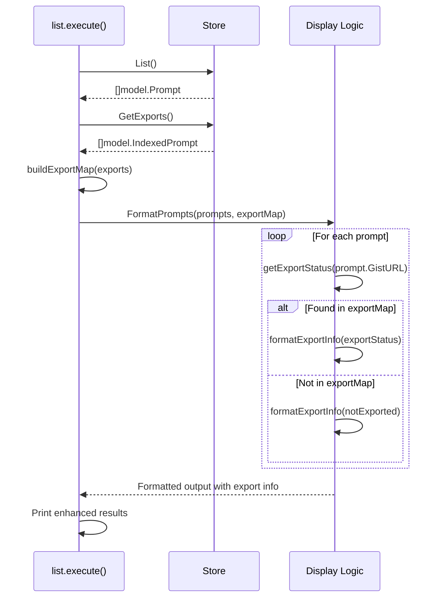

# 设计文档 - List 命令导出信息显示增强

## 简介

本文档概述了增强 `pv list` 命令以显示导出状态和导出 gist URL 的技术设计。该设计利用现有基础设施并遵循既定模式，同时增加了全面的导出信息可见性。

## 架构概述

该增强功能通过以下方式与现有列表命令架构集成：

1. **利用现有基础设施**：使用当前已为导出功能记录的 `IndexedPrompt.Parent` 字段
2. **扩展显示逻辑**：修改 `cmd/list.go` 中的输出格式以包含导出信息
3. **保持兼容性**：保留所有现有功能和接口

## 当前架构分析

### 要利用的现有组件
- **命令层**：`cmd/list.go` 包含 `(*list).execute()` 方法
- **数据模型**：
  - `model.Prompt` 用于基本 prompt 信息
  - `model.IndexedPrompt` 用于支持导出的索引 prompt 元数据
  - `model.Index` 包含 `Exports []IndexedPrompt` 字段用于跟踪导出
- **存储层**：`infra.Store` 接口包含：
  - `List() ([]model.Prompt, error)` 用于常规 prompt
  - `GetExports() ([]model.IndexedPrompt, error)` 用于导出数据
- **缓存**：`infra.CacheManager` 处理缓存/远程数据

### 当前显示格式
```
📝 Found N prompt(s):

  PromptName - author: AuthorName : https://gist.github.com/user/gistid
```

## 代码重用分析

### 利用现有基础设施

1. **Store 接口扩展**：`Store` 接口已包含：
   - `GetExports() ([]model.IndexedPrompt, error)` 方法用于检索导出数据
   - 导出管理方法（`AddExport`、`UpdateExport`）

2. **索引模型支持**：`model.Index` 结构包含：
   - `Exports []IndexedPrompt` 字段专门用于导出的 prompt
   - 适当的 JSON 序列化支持

3. **缓存集成**：现有的 `CachedStore` 将自动处理：
   - 通过 `GetExports()` 方法缓存导出数据
   - 使用 `--remote` 标志时的缓存失效

### 可重用组件

- **错误处理模式**：使用 `internal/errors/` 中的现有错误类型
- **显示工具**：遵循列表命令中的现有格式化模式
- **命令结构**：利用现有的 Cobra 命令设置
- **存储抽象**：使用现有存储接口无需修改

## 指导文档对齐

该设计与既定的架构原则保持一致：

### 技术架构合规性
- **清洁架构**：保持命令、服务和基础设施层之间的分离
- **依赖注入**：使用现有的基于 Wire 的 DI 模式
- **基于接口的设计**：利用现有 Store 接口无需修改
- **错误处理**：遵循既定的错误处理模式

### 代码组织标准
- **包结构**：新代码适合现有的 `cmd/` 包结构
- **命名约定**：遵循既定的 Go 命名约定
- **文档**：保持现有的文档标准

## 设计组件

### 1. 数据访问模式

#### 导出数据检索策略
系统将通过调用两个现有的 Store 方法使用双数据方法：

1. **获取常规 Prompt**：`store.List()` → `[]model.Prompt`
2. **获取导出数据**：`store.GetExports()` → `[]model.IndexedPrompt`
3. **关联数据**：通过 `GistURL` 匹配 prompt 与导出

#### 数据关联逻辑
```go
type ExportStatus struct {
    IsExported bool
    ExportURL  string
    ExportedBy string  // 导出的作者
}

// buildExportMap 创建导出状态的查找映射
func buildExportMap(exports []model.IndexedPrompt) map[string]ExportStatus {
    exportMap := make(map[string]ExportStatus)
    for _, export := range exports {
        if export.Parent != nil && *export.Parent != "" {
            exportMap[*export.Parent] = ExportStatus{
                IsExported: true,
                ExportURL:  export.GistURL,
                ExportedBy: export.Author,
            }
        }
    }
    return exportMap
}

// getExportStatus 查找给定 prompt 的导出状态
func getExportStatus(prompt model.Prompt, exportMap map[string]ExportStatus) ExportStatus {
    if status, exists := exportMap[prompt.GistURL]; exists {
        return status
    }
    return ExportStatus{IsExported: false}
}
```

#### 数据模型理解
基于现有代码分析：
- 导出中的 `IndexedPrompt.Parent` 指向**原始 prompt 的 GistURL**
- 导出中的 `IndexedPrompt.GistURL` 是**导出自身的 GistURL**
- 导出关系：`Export.Parent` → `Original.GistURL`

### 2. 显示格式设计

#### 增强的显示格式
```
📝 Found N prompt(s):

  PromptName - author: AuthorName : https://gist.github.com/user/gistid [✓ exported: https://gist.github.com/user/export_gistid]
  PromptName2 - author: AuthorName2 : https://gist.github.com/user2/gistid2 [not exported]
```

#### 可视化指示器
- **已导出**：`[✓ exported: <export_url>]`
- **未导出**：`[not exported]`
- **不支持 Unicode 的终端的替代方案**：`[exported: <export_url>]` / `[not exported]`

### 3. 实现架构

#### 组件修改

```mermaid
graph TD
    A[User runs pv list] --> B[list.execute()]
    B --> C{Remote flag?}
    C -->|Yes| D[Use direct store]
    C -->|No| E[Use cached store]
    D --> F[store.List()]
    E --> F
    F --> G[store.GetExports()]
    G --> H[buildExportMap()]
    H --> I[Process & correlate data]
    I --> J[Enhanced Display Logic]
    J --> K[Format with export info]
    K --> L[Display results]
    L --> M[Show cache info if applicable]
```

#### 增强的数据流序列



### 4. 代码结构

#### 增强的显示函数

```go
// 内部辅助函数（将添加到 cmd/list.go）

// ExportStatus 保存 prompt 的导出信息
type ExportStatus struct {
    IsExported bool
    ExportURL  string
    ExportedBy string
}

// buildExportMap 创建从 GistURL 到 ExportStatus 的查找映射
func buildExportMap(exports []model.IndexedPrompt) map[string]ExportStatus {
    exportMap := make(map[string]ExportStatus)
    for _, export := range exports {
        if export.Parent != nil && *export.Parent != "" {
            exportMap[*export.Parent] = ExportStatus{
                IsExported: true,
                ExportURL:  export.GistURL,
                ExportedBy: export.Author,
            }
        }
    }
    return exportMap
}

// formatExportInfo formats the export status display
func formatExportInfo(status ExportStatus) string {
    if !status.IsExported {
        return "[not exported]"
    }
    if status.ExportURL == "" {
        return "[export status unknown]"
    }
    return fmt.Sprintf("[✓ exported: %s]", status.ExportURL)
}

// formatPromptWithExport creates the enhanced display string
func formatPromptWithExport(prompt model.Prompt, exportMap map[string]ExportStatus) string {
    status := ExportStatus{IsExported: false}
    if s, exists := exportMap[prompt.GistURL]; exists {
        status = s
    }
    
    exportInfo := formatExportInfo(status)
    return fmt.Sprintf("  %s - author: %s : %s %s", 
        prompt.Name, prompt.Author, prompt.GistURL, exportInfo)
}
```

#### Modified Execute Method

The main changes in `(*list).execute()`:

```go
// After getting prompts from store.List()
var prompts, err = store.List()
if err != nil {
    // ... existing error handling ...
}

// NEW: Get export data and build lookup map
var exports []model.IndexedPrompt
var exportMap map[string]ExportStatus

if exports, err = store.GetExports(); err == nil {
    exportMap = buildExportMap(exports)
} else {
    // Graceful degradation: continue without export info
    exportMap = make(map[string]ExportStatus)
}

// Enhanced display loop:
fmt.Printf("📝 Found %d prompt(s):\n\n", len(prompts))
for i := range prompts {
    var prompt = prompts[i]
    fmt.Printf("%s\n", formatPromptWithExport(prompt, exportMap))
}
```

### 5. Data Flow Architecture

#### Export Information Retrieval and Correlation

```mermaid
graph LR
    A[store.List()] --> B[[]model.Prompt]
    C[store.GetExports()] --> D[[]model.IndexedPrompt]
    B --> E[Correlation Logic]
    D --> E
    E --> F[Export Status Map]
    F --> G[Enhanced Display]
    
    subgraph "Correlation Process"
    H[For each export] --> I{export.Parent != nil?}
    I -->|Yes| J[map[Parent] = ExportStatus]
    I -->|No| K[Skip export]
    end
```

#### Cache Integration

The enhancement will work seamlessly with the existing cache mechanism:

- **Cache Hit**: Export information comes from cached `IndexedPrompt` data
- **Cache Miss**: Export information fetched with remote data and cached
- **--remote Flag**: Always fetches latest export information from remote

### 6. Error Handling

#### Graceful Degradation
- **Missing Export Data**: Display "[export status unknown]"
- **Invalid Export URL**: Display "[export url invalid]"
- **Cache Errors**: Fall back to basic display without export info

#### Error Scenarios
```go
// Error handling examples
func formatExportInfo(isExported bool, exportURL string) string {
    if !isExported {
        return "[not exported]"
    }
    
    if exportURL == "" {
        return "[export status unknown]"
    }
    
    if !isValidGistURL(exportURL) {
        return "[export url invalid]"
    }
    
    return fmt.Sprintf("[✓ exported: %s]", exportURL)
}
```

### 7. Integration Points

#### Existing System Integration

1. **Store Interface**: No changes required to `infra.Store`
2. **Cache Manager**: Leverages existing cache for `IndexedPrompt` data
3. **Error Handling**: Uses existing error patterns and messages
4. **Command Structure**: Preserves all existing command interface

#### Future Extension Points

1. **Export Command Integration**: When export command is implemented, it can update the `Parent` field
2. **Additional Export Fields**: Easy to extend with more export metadata
3. **Different Display Modes**: Can add flags for different export info verbosity

### 8. Testing Strategy

#### Unit Testing
- Test export status determination logic
- Test display formatting functions
- Test error handling scenarios
- Test backward compatibility

#### Integration Testing
- Test with various cache states
- Test with --remote flag
- Test with missing/invalid export data
- Test performance impact

## Security Considerations

### URL Validation
- Export URLs will be validated as GitHub Gist URLs before display
- No execution or automatic opening of URLs
- XSS prevention through proper string formatting

### Data Privacy
- No sensitive information exposed through export status
- Export URLs are public GitHub Gist URLs
- Respects existing authentication and authorization

## Performance Considerations

### Minimal Performance Impact
- Export status checking adds minimal CPU overhead
- No additional network calls required
- Cache performance unaffected
- Memory usage increase negligible

### Optimization Opportunities
- Pre-compute export status during index loading
- Batch export status lookups if needed
- Lazy loading of export information

## Backward Compatibility

### Interface Preservation
- All existing command-line arguments preserved
- Output format extended, not changed
- Error handling patterns maintained
- Cache behavior unchanged

### Migration Strategy
- No data migration required
- Existing installations work without changes
- New export info appears automatically when available

## Success Criteria

1. **Functional**: Export status and URLs display correctly
2. **Performance**: No significant slowdown in list command execution  
3. **Compatibility**: All existing functionality works unchanged
4. **Usability**: Export information is clear and helpful
5. **Maintainable**: Code follows existing patterns and is testable

## Implementation Phases

### Phase 1: Basic Export Status Display
- Implement export status detection using existing `Parent` field
- Add basic display format with export indicators
- Ensure backward compatibility

### Phase 2: Enhanced Error Handling
- Add comprehensive error handling for edge cases
- Implement graceful degradation for missing data
- Add URL validation

### Phase 3: Testing and Polish
- Comprehensive test coverage
- Performance optimization
- Documentation updates