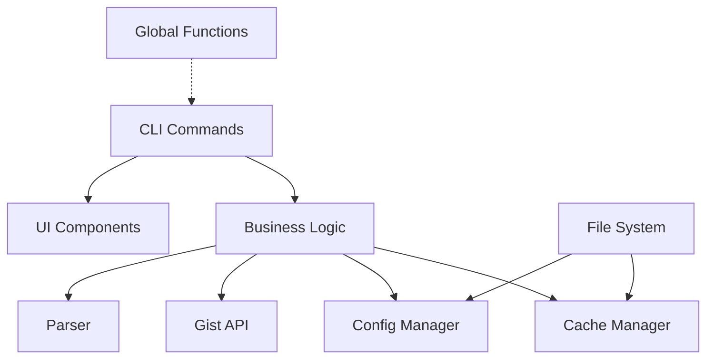
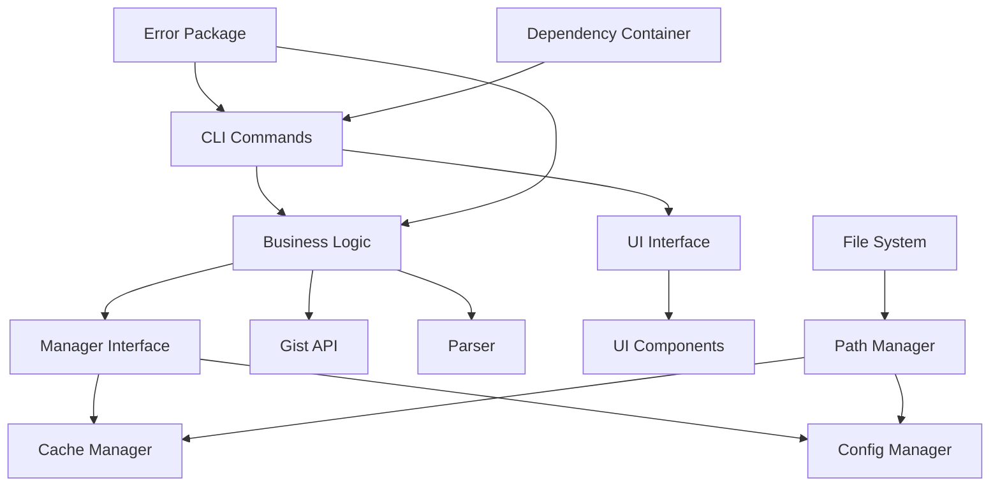

# Code Refactoring Design Document

## Overview

This design document outlines the technical approach for refactoring the prompts-vault project to improve code readability, maintainability, and architectural design while maintaining backward compatibility. The refactoring will focus on eliminating code duplication, standardizing patterns, and improving testability.

## Architecture

### Current Architecture



### Target Architecture



### Key Architectural Changes

1. **Introduction of Common Interfaces**: Manager and UI interfaces to standardize component behavior
2. **Centralized Error Handling**: A dedicated error package for consistent error management
3. **Path Management Module**: Unified handling of all file system paths
4. **Dependency Injection Container**: Replace global variables with proper dependency injection
5. **Abstract Base Implementations**: Reduce code duplication through inheritance

## Components and Interfaces

### 1. Error Handling Package (`internal/errors`)

```go
// internal/errors/errors.go
package errors

import (
    "fmt"
    "errors"
)

// Error types
type ErrorType int

const (
    ErrTypeAuth ErrorType = iota
    ErrTypeNetwork
    ErrTypeFileSystem
    ErrTypeValidation
    ErrTypeParsing
)

// AppError represents application errors with context
type AppError struct {
    Type    ErrorType
    Op      string // Operation that failed
    Err     error  // Underlying error
    Message string // User-friendly message
}

func (e *AppError) Error() string {
    if e.Message != "" {
        return e.Message
    }
    return fmt.Sprintf("%s: %v", e.Op, e.Err)
}

func (e *AppError) Unwrap() error {
    return e.Err
}

// Constructor functions
func NewAuthError(op string, err error) *AppError {
    return &AppError{
        Type:    ErrTypeAuth,
        Op:      op,
        Err:     err,
        Message: fmt.Sprintf("authentication failed during %s", op),
    }
}

func NewFileSystemError(op string, err error) *AppError {
    return &AppError{
        Type:    ErrTypeFileSystem,
        Op:      op,
        Err:     err,
        Message: fmt.Sprintf("file system error during %s", op),
    }
}

// Helper functions
func Wrap(op string, err error) error {
    if err == nil {
        return nil
    }
    return fmt.Errorf("%s: %w", op, err)
}
```

### 2. Path Management Module (`internal/paths`)

```go
// internal/paths/paths.go
package paths

import (
    "os"
    "path/filepath"
)

// PathManager handles all application paths
type PathManager struct {
    homeDir string
}

// NewPathManager creates a new path manager
func NewPathManager() *PathManager {
    homeDir, err := os.UserHomeDir()
    if err != nil {
        homeDir = "."
    }
    return &PathManager{homeDir: homeDir}
}

// NewPathManagerWithHome creates a path manager with custom home
func NewPathManagerWithHome(homeDir string) *PathManager {
    return &PathManager{homeDir: homeDir}
}

// GetCachePath returns the cache directory path
func (pm *PathManager) GetCachePath() string {
    return filepath.Join(pm.homeDir, ".cache", "prompt-vault", "prompts")
}

// GetConfigPath returns the config file path
func (pm *PathManager) GetConfigPath() string {
    return filepath.Join(pm.homeDir, ".config", "prompt-vault", "config.yaml")
}

// GetIndexPath returns the index file path
func (pm *PathManager) GetIndexPath() string {
    return filepath.Join(pm.GetCachePath(), "index.json")
}

// EnsureDir creates directory if it doesn't exist
func (pm *PathManager) EnsureDir(path string) error {
    return os.MkdirAll(path, 0700)
}

// AtomicWrite performs atomic file write
func (pm *PathManager) AtomicWrite(path string, data []byte, perm os.FileMode) error {
    dir := filepath.Dir(path)
    if err := pm.EnsureDir(dir); err != nil {
        return err
    }
    
    tempFile, err := os.CreateTemp(dir, ".tmp-*")
    if err != nil {
        return err
    }
    tempPath := tempFile.Name()
    
    defer func() {
        tempFile.Close()
        os.Remove(tempPath)
    }()
    
    if _, err := tempFile.Write(data); err != nil {
        return err
    }
    
    if err := tempFile.Close(); err != nil {
        return err
    }
    
    if err := os.Chmod(tempPath, perm); err != nil {
        return err
    }
    
    return os.Rename(tempPath, path)
}
```

### 3. Manager Interface (`internal/managers`)

```go
// internal/managers/manager.go
package managers

import "context"

// Manager defines common manager operations
type Manager interface {
    // Initialize prepares the manager
    Initialize(ctx context.Context) error
    
    // Cleanup performs cleanup operations
    Cleanup() error
    
    // IsInitialized checks if manager is ready
    IsInitialized() bool
}

// BaseManager provides common functionality
type BaseManager struct {
    initialized bool
}

func (bm *BaseManager) IsInitialized() bool {
    return bm.initialized
}

func (bm *BaseManager) SetInitialized(v bool) {
    bm.initialized = v
}
```

### 4. Updated Cache Manager

```go
// internal/cache/cache.go
package cache

import (
    "context"
    "sync"
    "github.com/yourusername/prompts-vault/internal/managers"
    "github.com/yourusername/prompts-vault/internal/paths"
)

type Manager struct {
    managers.BaseManager
    pathManager *paths.PathManager
    mu          sync.RWMutex
    index       *Index
}

func NewManager(pathManager *paths.PathManager) *Manager {
    return &Manager{
        pathManager: pathManager,
    }
}

func (m *Manager) Initialize(ctx context.Context) error {
    m.mu.Lock()
    defer m.mu.Unlock()
    
    if err := m.pathManager.EnsureDir(m.pathManager.GetCachePath()); err != nil {
        return err
    }
    
    m.SetInitialized(true)
    return nil
}
```

### 5. UI Component Interface (`internal/ui`)

```go
// internal/ui/component.go
package ui

import tea "github.com/charmbracelet/bubbletea"

// Component defines common UI component interface
type Component interface {
    tea.Model
    Reset()
    HasError() bool
    GetError() string
}

// BaseComponent provides common UI functionality
type BaseComponent struct {
    ShowError    bool
    ErrorMessage string
}

func (bc *BaseComponent) Reset() {
    bc.ShowError = false
    bc.ErrorMessage = ""
}

func (bc *BaseComponent) HasError() bool {
    return bc.ShowError
}

func (bc *BaseComponent) GetError() string {
    return bc.ErrorMessage
}

func (bc *BaseComponent) SetError(err error) {
    if err != nil {
        bc.ShowError = true
        bc.ErrorMessage = err.Error()
    }
}
```

### 6. Dependency Injection Container (`internal/container`)

```go
// internal/container/container.go
package container

import (
    "github.com/yourusername/prompts-vault/internal/cache"
    "github.com/yourusername/prompts-vault/internal/config"
    "github.com/yourusername/prompts-vault/internal/paths"
    "github.com/yourusername/prompts-vault/internal/gist"
)

// Container holds all application dependencies
type Container struct {
    PathManager   *paths.PathManager
    CacheManager  *cache.Manager
    ConfigManager *config.Manager
    GistClient    *gist.Client
}

// NewContainer creates a new dependency container
func NewContainer() *Container {
    pathManager := paths.NewPathManager()
    
    return &Container{
        PathManager:   pathManager,
        CacheManager:  cache.NewManager(pathManager),
        ConfigManager: config.NewManager(pathManager),
    }
}

// NewTestContainer creates a container for testing
func NewTestContainer(homeDir string) *Container {
    pathManager := paths.NewPathManagerWithHome(homeDir)
    
    return &Container{
        PathManager:   pathManager,
        CacheManager:  cache.NewManager(pathManager),
        ConfigManager: config.NewManager(pathManager),
    }
}
```

## Data Models

No changes to existing data models are required. The refactoring focuses on structural improvements rather than data model changes.

## Error Handling

### Error Handling Strategy

1. **Replace generic errors with typed errors**:
   ```go
   // Before
   return fmt.Errorf("failed to load index: %w", err)
   
   // After
   return errors.NewFileSystemError("load index", err)
   ```

2. **Consistent error wrapping**:
   ```go
   if err := m.SaveIndex(index); err != nil {
       return errors.Wrap("sync cache", err)
   }
   ```

3. **Error type checking for specific handling**:
   ```go
   var appErr *errors.AppError
   if errors.As(err, &appErr) {
       switch appErr.Type {
       case errors.ErrTypeAuth:
           // Handle auth errors
       case errors.ErrTypeNetwork:
           // Handle network errors
       }
   }
   ```

## Testing Strategy

### 1. Test Helpers Package (`internal/testhelpers`)

```go
// internal/testhelpers/helpers.go
package testhelpers

import (
    "testing"
    "github.com/yourusername/prompts-vault/internal/container"
)

// SetupTest creates a test environment
func SetupTest(t *testing.T) (*container.Container, func()) {
    t.Helper()
    
    tempDir := t.TempDir()
    cont := container.NewTestContainer(tempDir)
    
    cleanup := func() {
        // Any cleanup logic
    }
    
    return cont, cleanup
}

// AssertErrorType checks if error is of expected type
func AssertErrorType(t *testing.T, err error, expectedType errors.ErrorType) {
    t.Helper()
    
    var appErr *errors.AppError
    if !errors.As(err, &appErr) {
        t.Errorf("expected AppError, got %T", err)
        return
    }
    
    if appErr.Type != expectedType {
        t.Errorf("expected error type %v, got %v", expectedType, appErr.Type)
    }
}
```

### 2. Mock Implementations

```go
// internal/cache/mock.go
package cache

type MockManager struct {
    managers.BaseManager
    LoadIndexFunc func() (*Index, error)
    SaveIndexFunc func(*Index) error
}

func (m *MockManager) LoadIndex() (*Index, error) {
    if m.LoadIndexFunc != nil {
        return m.LoadIndexFunc()
    }
    return &Index{}, nil
}
```

### 3. Updated Test Pattern

```go
func TestListCommand(t *testing.T) {
    tests := []struct {
        name       string
        setupMock  func(*cache.MockManager)
        wantOutput []string
        wantErr    bool
    }{
        // test cases
    }
    
    for _, tt := range tests {
        t.Run(tt.name, func(t *testing.T) {
            cont, cleanup := testhelpers.SetupTest(t)
            defer cleanup()
            
            // Setup mocks
            mockCache := &cache.MockManager{}
            if tt.setupMock != nil {
                tt.setupMock(mockCache)
            }
            cont.CacheManager = mockCache
            
            // Run test
            cmd := NewListCommand(cont)
            // ... test logic
        })
    }
}
```

## Migration Strategy

### Phase 1: Foundation (Non-breaking)
1. Create new packages (errors, paths, managers, container, testhelpers)
2. Implement interfaces and base classes
3. Add comprehensive tests for new components

### Phase 2: Gradual Migration
1. Update managers to use new base classes and path manager
2. Replace error handling incrementally
3. Migrate CLI commands to use dependency container
4. Update tests to use test helpers

### Phase 3: Cleanup
1. Remove global variables
2. Delete duplicate code
3. Update documentation

### Backward Compatibility Assurance

1. **Public API preservation**: All CLI commands maintain same interface
2. **File path compatibility**: Path manager returns same paths as before
3. **Error message compatibility**: Error messages remain consistent
4. **Configuration compatibility**: No changes to config file format
5. **Cache format compatibility**: No changes to cache structure

## Design Decisions and Rationale

1. **Interface-based design**: Enables better testing and future extensibility
2. **Centralized path management**: Eliminates duplication and provides single source of truth
3. **Typed errors**: Improves error handling and debugging capabilities
4. **Dependency injection**: Improves testability and removes global state
5. **Base implementations**: Reduces code duplication while maintaining flexibility
6. **Atomic operations in path manager**: Ensures data integrity across the application

## Risk Mitigation

1. **Extensive testing**: Each phase includes comprehensive test coverage
2. **Gradual migration**: Changes are incremental to minimize risk
3. **Backward compatibility tests**: Ensure existing functionality is preserved
4. **Feature flags**: Can be used for gradual rollout if needed
5. **Rollback plan**: Each phase can be reverted independently