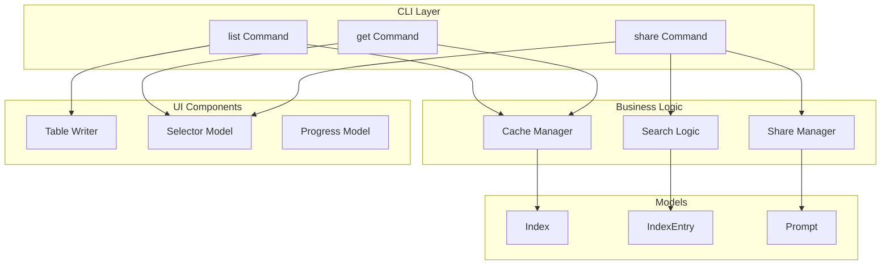
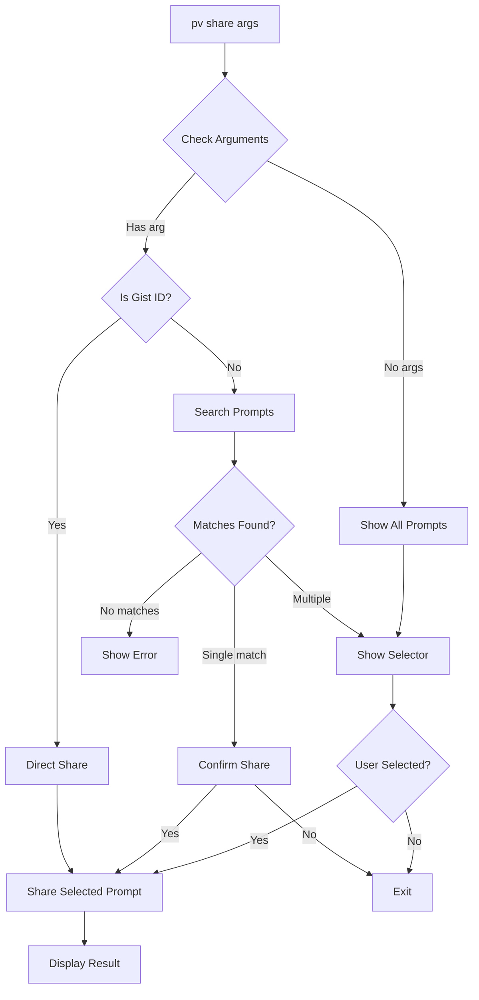

# Enhanced Prompt Sharing - Technical Design Document

## Overview

This document outlines the technical design for enhancing the prompts-vault (pv) command-line tool with improved gist URL visibility and extended share command functionality. The implementation follows Test-Driven Development (TDD) methodology.

## Architecture

### High-Level Component Interaction



## Components and Interfaces

### 1. List Command Enhancement

**Component**: `internal/cli/list.go`

**Changes Required**:
- Modify table header to include "Gist URL" column
- Add gist URL to table row output
- Handle URL truncation for terminal width compatibility

**Interface Changes**: None - maintains existing command interface

### 2. Get Command Enhancement

**Component**: `internal/cli/get.go`

**Changes Required**:
- Add gist URL display after prompt selection
- Include gist URL in the prompt details section
- Display URL before variable filling form

**Interface Changes**: None - maintains existing command interface

### 3. Share Command Enhancement

**Component**: `internal/cli/share.go`

**New Interfaces**:
```go
// promptSelector interface for selecting prompts
type promptSelector interface {
    SelectPrompt(entries []models.IndexEntry, title string) (int, error)
}

// promptSearcher interface for searching prompts
type promptSearcher interface {
    SearchPrompts(entries []models.IndexEntry, keyword string) []int
}
```

**Changes Required**:
- Modify command to accept 0 or 1 arguments
- Implement prompt selection logic when no arguments provided
- Implement keyword search when non-gist-ID argument provided
- Reuse existing share logic after prompt selection

### 4. Shared Components

**Search Logic**: Extract from `get.go` into a reusable component
```go
// internal/search/search.go
type Searcher struct{}

func (s *Searcher) SearchEntries(entries []models.IndexEntry, keyword string) []int
func (s *Searcher) MatchesKeyword(entry models.IndexEntry, keyword string) bool
```

**Selection UI**: Reuse existing `ui.SelectorModel` with consistent formatting

## Data Models

No changes required to existing data models. The `IndexEntry` already contains the `GistURL` field:

```go
type IndexEntry struct {
    GistID      string    `json:"gist_id"`
    GistURL     string    `json:"gist_url"`
    Name        string    `json:"name"`
    Author      string    `json:"author"`
    Category    string    `json:"category"`
    Tags        []string  `json:"tags"`
    Version     string    `json:"version"`
    Description string    `json:"description"`
    UpdatedAt   time.Time `json:"updated_at"`
}
```

## Implementation Details

### 1. URL Display Strategy

**Terminal Width Handling**:
- Use `golang.org/x/term` to detect terminal width
- Truncate URLs with ellipsis if they exceed available width
- For list command: Show shortened URL (e.g., "...abc123")
- For get command: Show full URL on separate line

### 2. Share Command Flow



### 3. Gist ID Detection

```go
func isGistID(input string) bool {
    // GitHub gist IDs are 32-character hexadecimal strings
    if len(input) != 32 {
        return false
    }
    for _, c := range input {
        if !((c >= '0' && c <= '9') || (c >= 'a' && c <= 'f')) {
            return false
        }
    }
    return true
}
```

## Error Handling

### New Error Scenarios

1. **No prompts available for sharing**
   - Message: "No prompts found. Use 'pv sync' to download prompts from GitHub."
   
2. **No matches found for keyword**
   - Message: "No prompts found matching '%s'."
   
3. **Selection cancelled**
   - Message: "No selection made."

### Existing Error Handling

Maintain all existing error handling for:
- Invalid gist IDs
- Network errors
- Authentication failures
- Gist not found

## Testing Strategy

### 1. Unit Tests Structure

```
internal/cli/
├── list_test.go         # Enhanced with gist URL display tests
├── get_test.go          # Enhanced with gist URL display tests
├── share_test.go        # Enhanced with new selection tests
└── test_helpers.go      # Shared test utilities

internal/search/
└── search_test.go       # New search logic tests
```

### 2. Test Scenarios

**List Command Tests**:
- Test gist URL display in table format
- Test URL truncation with narrow terminal
- Test pagination with URLs
- Test empty list behavior

**Get Command Tests**:
- Test gist URL display in search results
- Test URL display after selection
- Test URL in success message

**Share Command Tests**:
- Test no arguments → show all prompts
- Test keyword search → multiple matches
- Test keyword search → single match
- Test keyword search → no matches
- Test gist ID detection and direct share
- Test selection cancellation
- Test backward compatibility

### 3. Test Helpers

```go
// Mock implementations
type mockSelector struct {
    selectedIndex int
    cancelled     bool
}

type mockSearcher struct {
    results []int
}

// Test data builders
func buildTestIndex(count int) *models.Index
func buildTestEntry(name string) models.IndexEntry
```

### 4. Integration Tests

Use existing integration test patterns from `internal/integration/`:
- Test complete command flow
- Verify output formatting
- Test user interaction scenarios

## Performance Considerations

1. **Search Performance**: 
   - Reuse existing search algorithm from get command
   - O(n) complexity for keyword matching
   - Acceptable for typical prompt counts (<1000)

2. **UI Rendering**:
   - Minimal overhead for URL display
   - Table formatting remains efficient
   - No additional API calls required

3. **Memory Usage**:
   - No significant increase
   - URLs already loaded in IndexEntry

## Security Considerations

1. **URL Validation**:
   - Gist URLs are provided by GitHub API
   - No user-provided URLs accepted
   - No URL manipulation required

2. **Input Validation**:
   - Existing gist ID validation remains
   - Keyword search uses safe string matching
   - No SQL or command injection risks

## Migration and Rollback

No data migration required:
- Feature is additive only
- No changes to data structures
- No breaking changes to existing commands
- Can be rolled back by reverting code changes

## Future Enhancements

1. **Configurable URL Display**:
   - Allow users to toggle URL display
   - Configure URL format (full/shortened)

2. **Batch Operations**:
   - Share multiple prompts at once
   - Bulk URL export

3. **URL Shortcuts**:
   - Copy URL to clipboard directly
   - Open URL in browser

Does the design look good? If so, we can move on to the implementation plan.