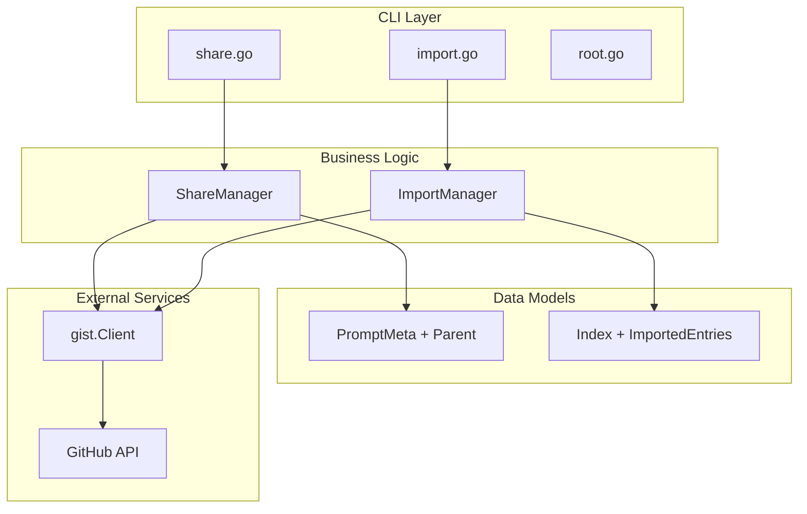

# Design Document: Prompt Sharing and Import Feature

## Overview

This design document outlines the technical implementation for adding `pv share` and `pv import` commands to the prompts-vault CLI. The implementation follows Test-Driven Development (TDD) methodology, ensuring comprehensive test coverage before writing production code.

### Key Features
1. **Share Command**: Creates public copies of private prompt gists with version tracking
2. **Import Command**: Imports external public prompt gists into user's collection

## Architecture

### Component Diagram



### Data Flow

#### Share Command Flow
1. User executes `pv share <gist-id>`
2. ShareManager validates gist exists and is private
3. Reads prompt content and metadata
4. Checks for existing public version (via parent field)
5. Creates new public gist or updates existing one
6. Adds parent field to public gist metadata
7. Returns public gist URL

#### Import Command Flow
1. User executes `pv import <gist-url>`
2. ImportManager extracts gist ID from URL
3. Fetches and validates gist content
4. Checks if gist already exists in imported_entries
5. Prompts for confirmation if version differs
6. Updates index with new/updated entry
7. Persists index to GitHub

## Components and Interfaces

### 1. CLI Commands

#### share.go
```go
package cli

type shareOptions struct {
    gistID string
}

func newShareCmd() *cobra.Command {
    // Command definition
    // Validates input
    // Calls ShareManager
}
```

#### import.go
```go
package cli

type importOptions struct {
    gistURL string
}

func newImportCmd() *cobra.Command {
    // Command definition
    // Validates URL format
    // Calls ImportManager
}
```

### 2. Managers

#### ShareManager
```go
package share

type Manager struct {
    gistClient *gist.Client
    ui         ui.Prompter
}

type ShareResult struct {
    PublicGistID  string
    PublicGistURL string
    IsUpdate      bool
}

func (m *Manager) SharePrompt(ctx context.Context, privateGistID string) (*ShareResult, error)
func (m *Manager) findExistingPublicGist(ctx context.Context, parentID string) (string, error)
func (m *Manager) createPublicGist(ctx context.Context, prompt *models.Prompt) (*ShareResult, error)
func (m *Manager) updatePublicGist(ctx context.Context, gistID string, prompt *models.Prompt) (*ShareResult, error)
```

#### ImportManager
```go
package imports

type Manager struct {
    gistClient *gist.Client
    ui         ui.Prompter
}

type ImportResult struct {
    GistID    string
    IsUpdate  bool
    OldVersion string
    NewVersion string
}

func (m *Manager) ImportPrompt(ctx context.Context, gistURL string, index *models.Index) (*ImportResult, error)
func (m *Manager) extractGistID(gistURL string) (string, error)
func (m *Manager) validatePromptGist(gist *github.Gist) (*models.Prompt, error)
func (m *Manager) checkExistingImport(index *models.Index, gistID string) (*models.IndexEntry, bool)
func (m *Manager) confirmVersionUpdate(oldEntry, newEntry *models.IndexEntry) (bool, error)
```

### 3. Data Models Updates

#### PromptMeta Enhancement
```go
// in models/prompt.go
type PromptMeta struct {
    Name        string   `yaml:"name" json:"name"`
    Author      string   `yaml:"author" json:"author"`
    Category    string   `yaml:"category" json:"category"`
    Tags        []string `yaml:"tags" json:"tags"`
    Version     string   `yaml:"version,omitempty" json:"version,omitempty"`
    Description string   `yaml:"description,omitempty" json:"description,omitempty"`
    Parent      string   `yaml:"parent,omitempty" json:"parent,omitempty"` // NEW FIELD
}
```

#### Index Enhancement
```go
// in models/prompt.go
type Index struct {
    Username        string       `json:"username"`
    Entries         []IndexEntry `json:"entries"`
    ImportedEntries []IndexEntry `json:"imported_entries"` // NEW FIELD
    UpdatedAt       time.Time    `json:"updated_at"`
}
```

### 4. GitHub Client Extensions

```go
// Extensions to gist/client.go
func (c *Client) CreatePublicGist(ctx context.Context, gistName, description, content string) (string, string, error)
func (c *Client) ListUserGists(ctx context.Context, username string) ([]*github.Gist, error)
func (c *Client) GetGistByURL(ctx context.Context, gistURL string) (*github.Gist, error)
```

## Error Handling

### Share Command Errors
- `ErrGistNotFound`: When specified gist doesn't exist
- `ErrGistNotPrivate`: When trying to share a public gist
- `ErrInvalidGistContent`: When gist doesn't contain valid prompt
- `ErrUpdateConfirmationCancelled`: When user cancels update

### Import Command Errors
- `ErrInvalidGistURL`: When URL format is incorrect
- `ErrGistNotAccessible`: When gist is private or doesn't exist
- `ErrInvalidPromptFormat`: When gist doesn't meet PromptMeta requirements
- `ErrImportConfirmationCancelled`: When user cancels import

### Error Messages
```go
const (
    msgGistNotPrivate = "Cannot share: gist %s is already public"
    msgParentGistNotFound = "Cannot find parent gist %s"
    msgInvalidGistURL = "Invalid gist URL format: %s"
    msgPrivateGistImport = "Cannot import private gist: %s"
    msgMissingRequiredFields = "Invalid prompt: missing required fields: %v"
)
```

## Testing Strategy

### TDD Implementation Phases

#### Phase 1: Data Model Tests
```go
// models/prompt_test.go
func TestPromptMeta_WithParentField(t *testing.T)
func TestPromptMeta_MarshalYAML_WithParent(t *testing.T)
func TestPromptMeta_UnmarshalYAML_WithParent(t *testing.T)

// models/index_test.go  
func TestIndex_WithImportedEntries(t *testing.T)
func TestIndex_AddImportedEntry(t *testing.T)
func TestIndex_UpdateImportedEntry(t *testing.T)
```

#### Phase 2: Manager Unit Tests
```go
// share/manager_test.go
func TestShareManager_ShareNewPublicGist(t *testing.T)
func TestShareManager_UpdateExistingPublicGist(t *testing.T)
func TestShareManager_SharePublicGist_Error(t *testing.T)
func TestShareManager_FindExistingByParent(t *testing.T)

// imports/manager_test.go
func TestImportManager_ImportNewGist(t *testing.T)
func TestImportManager_UpdateExistingImport(t *testing.T)
func TestImportManager_ImportPrivateGist_Error(t *testing.T)
func TestImportManager_ExtractGistID(t *testing.T)
func TestImportManager_ValidatePromptGist(t *testing.T)
```

#### Phase 3: CLI Integration Tests
```go
// cli/share_test.go
func TestShareCommand_Success(t *testing.T)
func TestShareCommand_InvalidGistID(t *testing.T)
func TestShareCommand_UpdateConfirmation(t *testing.T)

// cli/import_test.go
func TestImportCommand_Success(t *testing.T)
func TestImportCommand_InvalidURL(t *testing.T)
func TestImportCommand_VersionConflict(t *testing.T)
```

### Mock Strategy
- Use existing mock patterns from `gist/client_test.go`
- Create HTTP test servers for GitHub API responses
- Mock UI prompter for user confirmations

### Test Data
```go
var (
    testPrivateGist = &github.Gist{
        ID:          github.String("abc123"),
        Public:      github.Bool(false),
        Description: github.String("Test prompt"),
        Files: map[github.GistFilename]github.GistFile{
            "test.md": {
                Content: github.String(testPromptContent),
            },
        },
    }
    
    testPromptContent = `---
name: Test Prompt
author: testuser
category: testing
tags: [test, example]
version: "1.0.0"
---

This is a test prompt.`
)
```

## Security Considerations

1. **Token Security**: Use existing auth.Manager for token handling
2. **Input Validation**: Validate all user inputs before API calls
3. **Rate Limiting**: Handle GitHub API rate limits gracefully
4. **Privacy**: Ensure private gists remain private during share operation
5. **Data Integrity**: Validate prompt format before import

## Future Enhancements

1. Bulk operations (share/import multiple gists)
2. Selective content sharing (exclude certain fields)
3. Import from other sources (not just GitHub gists)
4. Share history tracking
5. Automated sync between private and public versions

---

设计文档看起来怎么样？如果满意的话，我们可以继续进行实施计划阶段。