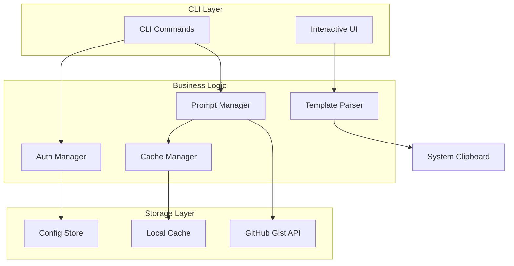

# Prompt Vault Design Document

## Overview

Prompt Vault is a command-line tool developed in Go for managing and using prompt templates. It uses GitHub Gist as the storage backend and provides functionality for creating, searching, using, and managing templates.

### Core Features
- GitHub Personal Access Token authentication
- Private Gist storage for prompt templates
- Interactive variable filling
- Local caching mechanism
- English user interface

### 技术栈选择
- **语言**: Go 1.23+ (兼容 Go 1.24.5)
- **GitHub API**: `github.com/google/go-github/v73`
- **CLI 框架**: `github.com/spf13/cobra`
- **交互式 UI**: `github.com/charmbracelet/bubbletea` + `github.com/charmbracelet/lipgloss`
- **剪贴板**: `github.com/atotto/clipboard`
- **YAML 解析**: `gopkg.in/yaml.v3`
- **配置管理**: `github.com/spf13/viper`

## Architecture

### 系统架构图



### 目录结构

```
prompt-vault/
├── cmd/
│   └── pv/
│       └── main.go          # 程序入口
├── internal/
│   ├── auth/               # 认证模块
│   │   └── auth.go
│   ├── cache/              # 缓存管理
│   │   └── cache.go
│   ├── cli/                # CLI 命令实现
│   │   ├── login.go
│   │   ├── upload.go
│   │   ├── list.go
│   │   ├── get.go
│   │   ├── delete.go
│   │   └── sync.go
│   ├── config/             # 配置管理
│   │   └── config.go
│   ├── gist/               # GitHub Gist API 封装
│   │   └── client.go
│   ├── models/             # 数据模型
│   │   └── prompt.go
│   ├── parser/             # 模板解析
│   │   └── parser.go
│   └── ui/                 # 交互式 UI 组件
│       ├── paginator.go
│       ├── form.go
│       └── selector.go
├── go.mod
├── go.sum
└── README.md
```

## Components and Interfaces

### 1. 认证管理器 (Auth Manager)

```go
type AuthManager interface {
    // 保存 GitHub token
    SaveToken(token string) error
    // 获取当前 token
    GetToken() (string, error)
    // 验证 token 有效性
    ValidateToken(token string) error
    // 获取当前用户信息
    GetCurrentUser() (string, error)
}
```

### 2. Prompt 管理器 (Prompt Manager)

```go
type PromptManager interface {
    // 上传 prompt
    Upload(filePath string) error
    // 列出所有 prompts
    List() ([]Prompt, error)
    // 搜索 prompts
    Search(keyword string) ([]Prompt, error)
    // 获取单个 prompt
    Get(gistID string) (*Prompt, error)
    // 删除 prompt
    Delete(name string) error
    // 同步缓存
    Sync() error
}
```

### 3. 缓存管理器 (Cache Manager)

```go
type CacheManager interface {
    // 保存 prompt 到缓存
    SavePrompt(prompt *Prompt) error
    // 从缓存获取 prompt
    GetPrompt(gistID string) (*Prompt, error)
    // 保存索引到缓存
    SaveIndex(prompts []Prompt) error
    // 从缓存获取索引
    GetIndex() ([]Prompt, error)
    // 清理缓存
    Clean() error
}
```

### 4. 模板解析器 (Template Parser)

```go
type TemplateParser interface {
    // 解析 prompt 文件
    ParseFile(filePath string) (*Prompt, error)
    // 提取变量
    ExtractVariables(content string) []string
    // 填充变量
    FillVariables(content string, values map[string]string) string
}
```

### 5. UI 组件

```go
// 分页器
type Paginator interface {
    Render(items []Prompt, currentPage int) string
    HandleKey(key tea.Key) (int, bool)
}

// 表单
type Form interface {
    Render(variables []string, values map[string]string) string
    HandleKey(key tea.Key) (map[string]string, bool)
}
```

## Data Models

### Prompt 数据模型

```go
// Prompt 元数据
type PromptMeta struct {
    Name        string   `yaml:"name" json:"name"`
    Author      string   `yaml:"author" json:"author"`
    Category    string   `yaml:"category" json:"category"`
    Tags        []string `yaml:"tags" json:"tags"`
    Version     string   `yaml:"version" json:"version"`
    Description string   `yaml:"description,omitempty" json:"description,omitempty"`
}

// Prompt 完整模型
type Prompt struct {
    PromptMeta
    GistID    string    `json:"gist_id"`
    GistURL   string    `json:"gist_url"`
    UpdatedAt time.Time `json:"updated_at"`
    Content   string    `json:"-"` // 不序列化到索引
}

// 索引条目
type IndexEntry struct {
    GistID      string    `json:"gist_id"`
    GistURL     string    `json:"gist_url"`
    Name        string    `json:"name"`
    Author      string    `json:"author"`
    Category    string    `json:"category"`
    Tags        []string  `json:"tags"`
    Version     string    `json:"version"`
    Description string    `json:"description"`
    UpdatedAt   time.Time `json:"updated_at"`
}
```

### 配置模型

```go
type Config struct {
    Token       string    `yaml:"token"`
    Username    string    `yaml:"username"`
    LastSync    time.Time `yaml:"last_sync"`
}
```

### 缓存结构

```
~/.cache/prompt-vault/
├── prompts/
│   ├── abc123def456.yaml    # 单个 prompt 缓存（保持原始 YAML 格式）
│   └── ...
├── index.json               # 索引缓存（JSON 格式，与 Gist 索引一致）
└── metadata.json            # 缓存元数据（最后同步时间等）
```

#### 缓存格式选择理由

1. **Prompt 文件缓存 (.yaml)**
   - 保持与 Gist 中存储的原始格式一致
   - 避免格式转换带来的信息丢失
   - 便于直接读取和使用，无需二次解析

2. **索引缓存 (index.json)**
   - 与 GitHub Gist 中的索引格式保持一致（`{username}-promptvault-index` 本身就是 JSON）
   - JSON 解析速度快，适合频繁的搜索操作
   - Go 标准库原生支持，性能更好

3. **元数据缓存 (metadata.json)**
   - 存储简单的键值对（如最后同步时间）
   - JSON 格式足够简单高效

## Error Handling

### 错误类型定义

```go
// 基础错误类型
type PromptVaultError struct {
    Code    string
    Message string
    Err     error
}

// 具体错误类型
var (
    ErrNotAuthenticated = &PromptVaultError{
        Code:    "AUTH001",
        Message: "Not authenticated, please run 'pv login' first",
    }
    
    ErrNetworkFailure = &PromptVaultError{
        Code:    "NET001",
        Message: "Network connection failed",
    }
    
    ErrPromptNotFound = &PromptVaultError{
        Code:    "PROMPT001",
        Message: "Prompt not found",
    }
    
    ErrInvalidFormat = &PromptVaultError{
        Code:    "FORMAT001",
        Message: "Invalid prompt file format",
    }
)
```

### 错误处理策略

1. **网络错误**: 自动重试 3 次，每次间隔 2 秒
2. **认证错误**: 提示用户重新运行 `pv login`
3. **格式错误**: 显示详细的错误位置和原因
4. **权限错误**: 明确提示用户权限不足

### 用户友好的错误消息

```go
func FormatError(err error) string {
    switch e := err.(type) {
    case *PromptVaultError:
        return fmt.Sprintf("❌ %s (Error Code: %s)", e.Message, e.Code)
    case *github.RateLimitError:
        return "❌ GitHub API rate limit exceeded, please try again later"
    default:
        if debug {
            return fmt.Sprintf("❌ Error occurred: %v", err)
        }
        return "❌ Operation failed, use -v flag for detailed information"
    }
}
```

## Testing Strategy - Test-Driven Development (TDD)

### TDD Development Process

This project will follow strict Test-Driven Development methodology:

1. **Red Phase**: Write a failing test for the desired functionality
2. **Green Phase**: Write minimal code to make the test pass
3. **Refactor Phase**: Improve the code while keeping tests green

### TDD Workflow Example

```go
// Step 1: Write failing test (RED)
func TestParsePromptFile_ValidYAML(t *testing.T) {
    content := `---
name: "API Documentation"
author: "john"
category: "docs"
tags: ["api", "swagger"]
---
Generate {format} documentation for {endpoint}`

    prompt, err := parser.ParsePromptFile(content)
    
    assert.NoError(t, err)
    assert.Equal(t, "API Documentation", prompt.Name)
    assert.Equal(t, []string{"format", "endpoint"}, prompt.Variables)
}

// Step 2: Implement minimal code (GREEN)
// Step 3: Refactor for clarity and performance
```

### Test Categories and Order

#### 1. Unit Tests (First Priority)

**Parser Module** (Start here):
```go
// Test file: internal/parser/parser_test.go
- TestParseYAMLFrontMatter
- TestExtractVariables
- TestFillVariables
- TestValidatePromptMeta
```

**Models** (Second):
```go
// Test file: internal/models/prompt_test.go
- TestPromptValidation
- TestIndexEntryMarshaling
```

**Cache Manager** (Third):
```go
// Test file: internal/cache/cache_test.go
- TestSavePrompt
- TestGetPrompt
- TestSaveIndex
- TestConcurrentAccess
```

#### 2. Integration Tests

**GitHub API Client**:
```go
// Test file: internal/gist/client_test.go
- TestCreateGist
- TestUpdateGist
- TestDeleteGist
- TestGetGist
```

**CLI Commands**:
```go
// Test files: internal/cli/*_test.go
- TestLoginCommand
- TestUploadCommand
- TestListCommand
- TestGetCommand
- TestDeleteCommand
- TestSyncCommand
```

#### 3. End-to-End Tests

```go
// Test file: e2e/workflow_test.go
- TestCompleteWorkflow
- TestErrorRecovery
- TestCrossplatformClipboard
```

### Testing Best Practices

1. **Test File Organization**
   ```
   internal/
   ├── parser/
   │   ├── parser.go
   │   └── parser_test.go    # Tests alongside implementation
   ├── cache/
   │   ├── cache.go
   │   └── cache_test.go
   ```

2. **Test Naming Convention**
   - `Test<FunctionName>_<Scenario>`
   - Example: `TestParseFile_InvalidYAML`

3. **Table-Driven Tests**
   ```go
   func TestExtractVariables(t *testing.T) {
       tests := []struct {
           name     string
           input    string
           expected []string
       }{
           {"single variable", "Hello {name}", []string{"name"}},
           {"multiple variables", "{greeting} {name}!", []string{"greeting", "name"}},
           {"duplicate variables", "{name} meets {name}", []string{"name"}},
       }
       
       for _, tt := range tests {
           t.Run(tt.name, func(t *testing.T) {
               result := ExtractVariables(tt.input)
               assert.Equal(t, tt.expected, result)
           })
       }
   }
   ```

4. **Mock Interfaces**
   ```go
   type MockGitHubClient struct {
       mock.Mock
   }
   
   func (m *MockGitHubClient) CreateGist(gist *github.Gist) (*github.Gist, error) {
       args := m.Called(gist)
       return args.Get(0).(*github.Gist), args.Error(1)
   }
   ```

### Testing Tools and Libraries

- **Testing Framework**: `testing` (Go standard library)
- **Assertions**: `github.com/stretchr/testify/assert`
- **Mocking**: `github.com/stretchr/testify/mock`
- **HTTP Mocking**: `github.com/jarcoal/httpmock`
- **Test Coverage**: `go test -cover`
- **Race Detection**: `go test -race`

### Test Coverage Requirements

- **Minimum Coverage**: 80% overall
- **Core Business Logic**: 95%+ (parser, models, cache)
- **API Integration**: 85%+ (with mocks)
- **CLI Commands**: 80%+
- **UI Components**: 70%+

### Continuous Testing

1. **Pre-commit Hook**: Run unit tests before each commit
2. **CI Pipeline**: Run full test suite on each push
3. **Coverage Report**: Generate and track coverage trends
4. **Performance Tests**: Benchmark critical operations

### TDD Implementation Order

1. Start with `internal/models` - Define data structures with tests
2. Move to `internal/parser` - Build parsing logic test-first
3. Implement `internal/cache` - Storage layer with tests
4. Build `internal/gist` - GitHub API with mocked tests
5. Create `internal/cli` commands - One command at a time
6. Develop `internal/ui` components - With interaction tests
7. Integrate all components with e2e tests

## 性能考虑

1. **缓存策略**
   - 索引缓存有效期: 1 小时
   - Prompt 缓存: 永久（通过 sync 更新）
   - 并发下载: 最多 5 个并发

2. **API 调用优化**
   - 批量获取 Gist 信息
   - 使用 ETag 进行条件请求
   - 实现请求队列避免超限

3. **UI 响应性**
   - 异步加载数据
   - 虚拟滚动（大列表）
   - 加载状态提示

---

设计文档是否符合需求？如果确认无误，我们可以进入任务规划阶段。